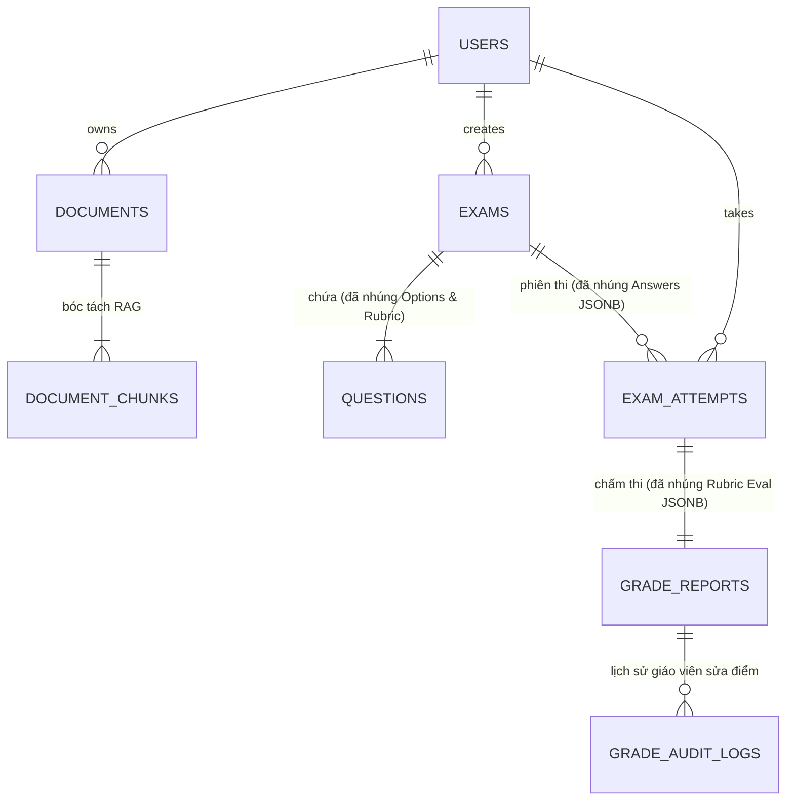

# Thiết kế Cơ sở Dữ liệu PostgreSQL Hybrid (SQL + NoSQL JSONB) - OwnEdu

**Dự án**: OwnEdu  
**Kiến trúc CSDL**: PostgreSQL Hybrid (Relational Core + Document JSONB Engine)  
**Công nghệ**: PostgreSQL 16+ & Redis 7+  
**Chiến lược**: Database per Service  
**Phiên bản**: 2.0.0 (Cập nhật Kiến trúc Hybrid)  
**Tài liệu liên quan**:
- [system-architecture.md](file:///C:/Nexis/ownedu/docs/_architecture/system-architecture.md)
- [api-contracts.md](file:///C:/Nexis/ownedu/docs/_architecture/api-contracts.md)
- [prompt-engineering-spec.md](file:///C:/Nexis/ownedu/docs/_architecture/prompt-engineering-spec.md)

---

## 1. Triết Lý Thiết Kế CSDL PostgreSQL Hybrid

Mô hình **PostgreSQL Hybrid** kết hợp hài hòa điểm mạnh của cả hai mô hình dữ liệu:
1. **Phần SQL (Relational ACID)**: Đảm nhận các trường định danh (`UUID`), liên kết khóa ngoại (`FOREIGN KEY`), trạng thái vòng đời (`status`), thời gian (`TIMESTAMPTZ`) và bảo đảm tính nhất quán giao dịch nghiêm ngặt cho bài thi, điểm số.
2. **Phần NoSQL (Document JSONB)**: Nhúng trực tiếp các cấu trúc phân cấp, đa hình và mảng dữ liệu (danh sách phương án trắc nghiệm, barem rubric, toàn bộ câu trả lời nháp, phân tích năng lực Bloom) vào các cột `JSONB` có hỗ trợ **Chỉ mục GIN (Generalized Inverted Index)**.

### 🌟 4 Lợi ích Cốt lõi của Mô hình Hybrid này:
- **Khớp 1:1 với AI LLM**: Output JSON từ Google Gemini / OpenAI được lưu trực tiếp vào CSDL mà không cần bóc tách thành nhiều bảng con.
- **Loại bỏ hoàn toàn các bảng trung gian**: Giảm bớt 3 bảng phức tạp (`question_options`, `question_rubrics`, `attempt_answers`, `rubric_evaluations`).
- **Tốc độ Đọc/Ghi Cực Hạn (Zero Multi-Join)**: Tải toàn bộ đề thi kèm phương án và rubric chỉ bằng **1 câu lệnh SELECT duy nhất** không cần `JOIN`.
- **Đơn giản hóa Code Backend**: Giảm 50% mã nguồn ORM/Entity mapping cho lập trình viên.

---

## 2. Sơ đồ Thực Thể PostgreSQL Hybrid Toàn Hệ Thống



---

## 3. Schema: `auth_db` (Quản lý Tài khoản & Hạn ngạch)

```sql
CREATE EXTENSION IF NOT EXISTS "uuid-ossp";

-- Bảng Người dùng (SQL Core + NoSQL Preferences)
CREATE TABLE users (
    id UUID PRIMARY KEY DEFAULT uuid_generate_v4(),
    email VARCHAR(255) UNIQUE NOT NULL,
    password_hash VARCHAR(255) NOT NULL,
    full_name VARCHAR(150) NOT NULL,
    role VARCHAR(30) NOT NULL DEFAULT 'STUDENT', -- 'STUDENT', 'TEACHER', 'ADMIN'
    tier VARCHAR(20) NOT NULL DEFAULT 'FREE',     -- 'FREE', 'PRO'
    
    -- [NoSQL]: Tùy biến giao diện, thông báo, môn học quan tâm
    preferences JSONB NOT NULL DEFAULT '{"theme": "system", "email_notifications": true}'::jsonb,
    
    is_active BOOLEAN NOT NULL DEFAULT TRUE,
    created_at TIMESTAMPTZ NOT NULL DEFAULT NOW(),
    updated_at TIMESTAMPTZ NOT NULL DEFAULT NOW()
);

-- Bảng Hạn ngạch Sử dụng (Kiểm soát hạn ngạch sinh đề RULE-GEN-004)
CREATE TABLE user_quotas (
    id UUID PRIMARY KEY DEFAULT uuid_generate_v4(),
    user_id UUID NOT NULL REFERENCES users(id) ON DELETE CASCADE,
    daily_exam_gen_limit INT NOT NULL DEFAULT 5,
    daily_exam_gen_used INT NOT NULL DEFAULT 0,
    quota_reset_date DATE NOT NULL DEFAULT CURRENT_DATE,
    created_at TIMESTAMPTZ NOT NULL DEFAULT NOW(),
    updated_at TIMESTAMPTZ NOT NULL DEFAULT NOW(),
    CONSTRAINT uq_user_quota_date UNIQUE (user_id, quota_reset_date)
);

CREATE INDEX idx_users_email ON users(email);
CREATE INDEX idx_user_quotas_lookup ON user_quotas(user_id, quota_reset_date);
```

---

## 4. Schema: `document_db` (Microservice: `document-service`)

```sql
-- Bảng Quản lý Tài liệu
CREATE TABLE documents (
    id UUID PRIMARY KEY DEFAULT uuid_generate_v4(),
    user_id UUID NOT NULL,
    filename VARCHAR(255) NOT NULL,
    file_type VARCHAR(10) NOT NULL, -- 'pdf', 'docx'
    mime_type VARCHAR(100) NOT NULL,
    file_size_bytes BIGINT NOT NULL,
    storage_path VARCHAR(500) NOT NULL, -- URL lưu trữ Cloudflare R2 / S3
    page_count INT,
    status VARCHAR(30) NOT NULL DEFAULT 'UPLOADING', -- 'UPLOADING', 'PROCESSING', 'PARSED', 'FAILED'
    error_message TEXT,
    
    -- [NoSQL]: Metadata chi tiết cấu trúc (mục lục, tác giả, tiêu đề chương)
    extracted_outline JSONB DEFAULT '[]'::jsonb,
    
    created_at TIMESTAMPTZ NOT NULL DEFAULT NOW(),
    updated_at TIMESTAMPTZ NOT NULL DEFAULT NOW(),
    deleted_at TIMESTAMPTZ
);

-- Bảng Đoạn Văn Bản (Chunks) phục vụ RAG
CREATE TABLE document_chunks (
    id UUID PRIMARY KEY DEFAULT uuid_generate_v4(),
    document_id UUID NOT NULL REFERENCES documents(id) ON DELETE CASCADE,
    chunk_index INT NOT NULL,
    page_number INT,
    chapter_title VARCHAR(255),
    content_text TEXT NOT NULL,
    token_estimate INT NOT NULL,
    
    -- [NoSQL]: Bảng biểu, chú thích hình ảnh, thuộc tính định dạng
    chunk_metadata JSONB DEFAULT '{}'::jsonb,
    
    created_at TIMESTAMPTZ NOT NULL DEFAULT NOW()
);

CREATE INDEX idx_documents_user_status ON documents(user_id, status) WHERE deleted_at IS NULL;
CREATE INDEX idx_document_chunks_doc_idx ON document_chunks(document_id, chunk_index);
CREATE INDEX idx_document_chunks_metadata_gin ON document_chunks USING GIN (chunk_metadata);
```

---

## 5. Schema: `exam_db` (Microservice: `exam-service`)

Đây là trung tâm ứng dụng mô hình **Hybrid** mạnh mẽ nhất: Nhúng trực tiếp phương án trắc nghiệm và barem rubric vào bảng `questions`, nhúng toàn bộ câu trả lời vào bảng `exam_attempts`.

```sql
-- Bảng Đề thi (Exams)
CREATE TABLE exams (
    id UUID PRIMARY KEY DEFAULT uuid_generate_v4(),
    document_id UUID NOT NULL,
    creator_user_id UUID NOT NULL,
    title VARCHAR(255) NOT NULL,
    description TEXT,
    suggested_duration_minutes INT NOT NULL DEFAULT 45,
    total_score NUMERIC(5, 2) NOT NULL DEFAULT 10.0,
    status VARCHAR(30) NOT NULL DEFAULT 'GENERATING', -- 'GENERATING', 'READY_FOR_REVIEW', 'PUBLISHED', 'ARCHIVED'
    access_code VARCHAR(12) UNIQUE,
    
    -- [NoSQL]: Cấu hình sinh đề (tỷ lệ Bloom, đối tượng, phân bổ MCQ/Essay)
    config JSONB NOT NULL DEFAULT '{}'::jsonb,
    
    created_at TIMESTAMPTZ NOT NULL DEFAULT NOW(),
    updated_at TIMESTAMPTZ NOT NULL DEFAULT NOW()
);

-- Bảng Câu hỏi (Questions - Tích hợp Đa hình Hybrid)
CREATE TABLE questions (
    id UUID PRIMARY KEY DEFAULT uuid_generate_v4(),
    exam_id UUID NOT NULL REFERENCES exams(id) ON DELETE CASCADE,
    order_index INT NOT NULL,
    question_type VARCHAR(20) NOT NULL, -- 'MCQ' hoặc 'ESSAY'
    bloom_level VARCHAR(30) NOT NULL,   -- 'REMEMBER', 'UNDERSTAND', 'APPLY', 'ANALYZE'
    content TEXT NOT NULL,
    points NUMERIC(4, 2) NOT NULL DEFAULT 0.5,
    
    -- [NoSQL - Dành riêng cho MCQ]: Mảng 4 phương án lựa chọn
    /* Cấu trúc JSON:
       [
         {"key": "A", "content": "REST API đồng bộ"},
         {"key": "B", "content": "Saga Pattern qua Message Queue"},
         {"key": "C", "content": "Two-Phase Commit"},
         {"key": "D", "content": "Shared Database"}
       ]
    */
    options JSONB DEFAULT '[]'::jsonb,
    correct_answer CHAR(1), -- 'A', 'B', 'C', 'D' (Chỉ dùng cho MCQ)
    explanation TEXT,       -- Giải thích đáp án chi tiết
    
    -- [NoSQL - Dành riêng cho ESSAY]: Mảng tiêu chí Barem Rubric
    /* Cấu trúc JSON:
       [
         {"criteria": "Nêu được ít nhất 2 ưu điểm của Saga", "max_points": 1.0},
         {"criteria": "Chỉ ra nhược điểm về eventual consistency", "max_points": 0.5},
         {"criteria": "Lấy ví dụ luồng đơn hàng thực tế", "max_points": 1.0}
       ]
    */
    rubric JSONB DEFAULT '[]'::jsonb,
    benchmark_answer TEXT,  -- Câu trả lời mẫu chuẩn mực
    
    created_at TIMESTAMPTZ NOT NULL DEFAULT NOW()
);

-- Bảng Phiên Làm Bài Thi (Exam Attempts - Nhúng Toàn Bộ Bài Làm)
CREATE TABLE exam_attempts (
    id UUID PRIMARY KEY DEFAULT uuid_generate_v4(),
    exam_id UUID NOT NULL REFERENCES exams(id) ON DELETE RESTRICT,
    user_id UUID NOT NULL,
    started_at TIMESTAMPTZ NOT NULL DEFAULT NOW(),
    expires_at TIMESTAMPTZ NOT NULL, -- Server-Authoritative Timer (RULE-TEST-001)
    submitted_at TIMESTAMPTZ,
    status VARCHAR(30) NOT NULL DEFAULT 'IN_PROGRESS', -- 'IN_PROGRESS', 'SUBMITTED', 'GRADED'
    submission_type VARCHAR(30),     -- 'MANUAL', 'AUTO_TIMEOUT'
    
    -- [NoSQL]: Snapshot Toàn bộ Câu Trả Lời & Cờ Đánh Dấu (Auto-Saved Payload)
    /* Cấu trúc JSON:
       {
         "q_uuid_1": {"type": "MCQ", "selected_option": "B", "is_flagged": false, "saved_at": "2026-09-18T23:30:00Z"},
         "q_uuid_2": {"type": "ESSAY", "essay_text": "Tách riêng qua Message Queue...", "word_count": 312, "is_flagged": true, "saved_at": "2026-09-18T23:32:15Z"}
       }
    */
    answers JSONB NOT NULL DEFAULT '{}'::jsonb,
    
    created_at TIMESTAMPTZ NOT NULL DEFAULT NOW(),
    updated_at TIMESTAMPTZ NOT NULL DEFAULT NOW()
);

-- Chỉ mục Tối ưu Truy vấn
CREATE INDEX idx_exams_creator ON exams(creator_user_id, status);
CREATE INDEX idx_questions_exam ON questions(exam_id, order_index);
CREATE INDEX idx_questions_options_gin ON questions USING GIN (options);
CREATE INDEX idx_questions_rubric_gin ON questions USING GIN (rubric);
CREATE INDEX idx_attempts_user_exam ON exam_attempts(user_id, exam_id, status);
CREATE INDEX idx_attempts_active_expiry ON exam_attempts(expires_at) WHERE status = 'IN_PROGRESS';
CREATE INDEX idx_attempts_answers_gin ON exam_attempts USING GIN (answers);
```

---

## 6. Schema: `grading_db` (Microservice: `grading-service`)

```sql
-- Bảng Báo Cáo Kết Quả Điểm Số & Phân Tích
CREATE TABLE grade_reports (
    id UUID PRIMARY KEY DEFAULT uuid_generate_v4(),
    attempt_id UUID UNIQUE NOT NULL, -- 1-1 với exam_attempts
    exam_id UUID NOT NULL,
    user_id UUID NOT NULL,
    mcq_score NUMERIC(5, 2) NOT NULL DEFAULT 0.0,
    essay_score NUMERIC(5, 2) NOT NULL DEFAULT 0.0,
    final_score NUMERIC(5, 2) NOT NULL DEFAULT 0.0, -- Thang điểm 10 quy chuẩn
    ai_score NUMERIC(5, 2) NOT NULL DEFAULT 0.0,    -- Điểm gốc do AI chấm
    status VARCHAR(30) NOT NULL DEFAULT 'PROCESSING', -- 'PROCESSING', 'FINALIZED', 'OVERRIDDEN'
    correct_mcq_count INT NOT NULL DEFAULT 0,
    total_mcq_count INT NOT NULL DEFAULT 0,
    completion_time_seconds INT NOT NULL,
    
    -- [NoSQL]: Chi tiết kết quả từng câu trắc nghiệm (đáp án chọn, đáp án đúng, giải thích)
    mcq_details JSONB NOT NULL DEFAULT '[]'::jsonb,
    
    -- [NoSQL]: Đánh giá chi tiết từng tiêu chí Rubric cho câu tự luận từ AI
    /* Cấu trúc JSON:
       [
         {
           "question_id": "q_uuid_2",
           "earned_points": 2.0,
           "max_points": 2.5,
           "general_comment": "Bài viết phân tích ưu điểm rất tốt, ví dụ thực tế hơi ngắn.",
           "rubric_evaluations": [
             {"criteria": "Nêu 2 ưu điểm", "earned_points": 1.0, "max_points": 1.0, "feedback": "Đạt tối đa."},
             {"criteria": "Ví dụ thực tế", "earned_points": 0.5, "max_points": 1.0, "feedback": "Chưa chỉ rõ service."}
           ]
         }
       ]
    */
    rubric_evaluations JSONB NOT NULL DEFAULT '[]'::jsonb,
    
    -- [NoSQL]: Biểu đồ Radar năng lực theo 4 mức Bloom Taxonomy
    bloom_analytics JSONB NOT NULL DEFAULT '{}'::jsonb,
    
    -- [NoSQL]: Lỗ hổng kiến thức & liên kết tài liệu cần ôn tập lại
    knowledge_gaps JSONB NOT NULL DEFAULT '[]'::jsonb,
    
    created_at TIMESTAMPTZ NOT NULL DEFAULT NOW(),
    updated_at TIMESTAMPTZ NOT NULL DEFAULT NOW()
);

-- Bảng Nhật Ký Giáo Viên Sửa Điểm (Audit Trail - Đảm bảo Tính Minh Bạch)
CREATE TABLE grade_audit_logs (
    id UUID PRIMARY KEY DEFAULT uuid_generate_v4(),
    grade_report_id UUID NOT NULL REFERENCES grade_reports(id) ON DELETE CASCADE,
    question_id UUID NOT NULL,
    teacher_id UUID NOT NULL,
    old_score NUMERIC(4, 2) NOT NULL,
    new_score NUMERIC(4, 2) NOT NULL,
    override_reason TEXT NOT NULL,
    created_at TIMESTAMPTZ NOT NULL DEFAULT NOW()
);

CREATE INDEX idx_grade_reports_user ON grade_reports(user_id, exam_id);
CREATE INDEX idx_grade_reports_rubric_gin ON grade_reports USING GIN (rubric_evaluations);
CREATE INDEX idx_grade_reports_bloom_gin ON grade_reports USING GIN (bloom_analytics);
```

---

## 7. Mẫu Truy Vấn Nhanh Trên Cấu Trúc Hybrid (Code Snippets Cho Dev)

### 7.1. Lấy toàn bộ đề thi để Render Phòng Thi (Không cần JOIN):
```sql
SELECT 
    id, order_index, question_type, bloom_level, content, points,
    -- Giấu đáp án đúng khi trả về cho thí sinh đang làm bài
    CASE 
        WHEN question_type = 'MCQ' THEN 
            (SELECT jsonb_agg(jsonb_build_object('key', opt->>'key', 'content', opt->>'content'))
             FROM jsonb_array_elements(options) AS opt)
        ELSE '[]'::jsonb 
    END AS safe_options
FROM questions 
WHERE exam_id = '91827364-55aa-44bb-33cc-221100aabbcc'
ORDER BY order_index ASC;
```

### 7.2. Auto-save câu trả lời đơn lẻ vào cột `answers` JSONB:
```sql
-- Cập nhật tức thì câu trả lời của câu hỏi q_01 mà không ghi đè các câu khác
UPDATE exam_attempts 
SET 
    answers = jsonb_set(
        answers, 
        '{q_01}', 
        '{"type": "MCQ", "selected_option": "B", "saved_at": "2026-09-18T23:35:00Z"}'::jsonb, 
        true
    ),
    updated_at = NOW()
WHERE id = '11223344-aabb-ccdd-eeff-001122334455' AND status = 'IN_PROGRESS';
```

### 7.3. Tìm các bài thi mà học sinh đạt điểm Rubric tuyệt đối ở một tiêu chí:
```sql
SELECT attempt_id, user_id 
FROM grade_reports 
WHERE rubric_evaluations @> '[{"rubric_evaluations": [{"earned_points": 1.0, "max_points": 1.0}]}]';
```
