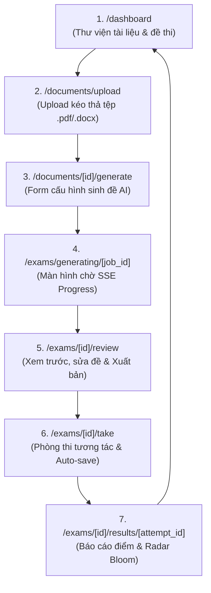

# Kiến Trúc Giao Diện & Bố Cục Màn Hình (Frontend Architecture & UI Specs) - OwnEdu

**Dự án**: OwnEdu  
**Nền tảng**: Web Application (Responsive Desktop & Tablet / Mobile)  
**Công nghệ khuyến nghị**: Next.js 14+ (App Router) / React 18+ / TypeScript  
**Quản lý Trạng thái**: Zustand (Client Session Store) & TanStack Query (Server State Cache)  
**Biểu đồ**: Recharts / Chart.js (Radar Chart Bloom)  
**Phiên bản**: 1.0.0  
**Tài liệu liên quan**:
- [api-contracts.md](file:///C:/Nexis/ownedu/docs/_architecture/api-contracts.md)
- [database-design.md](file:///C:/Nexis/ownedu/docs/_architecture/database-design.md)
- [interactive-testing-spec.md](file:///C:/Nexis/ownedu/docs/interactive-testing/srs/interactive-testing-spec.md)

---

## 1. Bản Đồ Màn Hình & Luồng Điều Hướng (Site Map & Screen Flow)



---

## 2. Bố Cục Wireframe Chi Tiết Màn Hình Trọng Tâm

### 2.1. Màn hình Phòng Thi Trực Tuyến (Exam Room Layout - `/exams/[id]/take`)
Màn hình kích hoạt chế độ **Fullscreen Focus**, ẩn toàn bộ thanh menu website thông thường để thí sinh tập trung tối đa.

```
+-----------------------------------------------------------------------------------------------+
|  [OwnEdu Logo]   Đề thi: Kiến trúc Microservices       [Đã tự động lưu 14:32:05 ✓]   [00:42:15 ⏱] |
+-----------------------------------------------------------------------------------------------+
|  VÙNG NỘI DUNG CÂU HỎI (70% CHIỀU RỘNG)                 | BẢNG ĐIỀU HƯỚNG CÂU HỎI (30%)        |
|                                                         |                                       |
|  Câu 02 / 17  [Mức độ: VẬN DỤNG]   [Điểm: 2.5đ]         | Danh sách câu hỏi:                    |
|  ----------------------------------------------------   | +-----+-----+-----+-----+-----+       |
|  Hãy phân tích ưu và nhược điểm của việc tách riêng     | | 01✓ | 02* | 03  | 04✓ | 05✓ |       |
|  Document Service và AI Worker Service qua Message      | +-----+-----+-----+-----+-----+       |
|  Queue thay vì gọi đồng bộ qua REST API.                | | 06  | 07✓ | 08⚑ | 09  | 10✓ |       |
|                                                         | +-----+-----+-----+-----+-----+       |
|  [Khung Soạn Thảo Bài Làm Tự Luận]                      | | 11✓ | 12  | 13  | 14✓ | 15✓ |       |
|  +---------------------------------------------------+  | +-----+-----+-----+-----+-----+       |
|  | Việc tách riêng Document Service và AI Worker     |  | | 16⚑ | 17  |                         |
|  | mang lại khả năng mở rộng độc lập...              |  | +-----+-----+                         |
|  |                                                   |  |                                       |
|  |                                                   |  | Chú thích:                            |
|  |                                                   |  | [✓] Xanh lá: Đã trả lời (8/17)        |
|  +---------------------------------------------------+  | [⚑] Vàng cam: Đang cắm cờ xem lại     |
|  Số từ: 248 từ   |   [Tự động lưu sau 2s dừng gõ]       | [*] Xanh viền: Câu đang chọn          |
|                                                         | [ ] Xám nhạt: Chưa làm (9/17)         |
|  [⚑ Đánh dấu xem lại]                                   |                                       |
|                                                         | ------------------------------------- |
|  [< Câu trước]                         [Câu tiếp theo >]| [   NỘP BÀI THI CHÍNH THỨC   ]        |
+-----------------------------------------------------------------------------------------------+
```

---

### 2.2. Màn hình Báo Cáo Kết Quả & Năng Lực (`/exams/[id]/results/[attempt_id]`)

```
+-----------------------------------------------------------------------------------------------+
|  KẾT QUẢ BÀI THI: Kiểm tra Giữa kỳ - Kiến trúc Microservices               [Thí sinh: Nam Nguyễn]
+-----------------------------------------------------------------------------------------------+
|  [ HERO CARD TỔNG KẾT ]                                                                       |
|  +---------------------------+  +---------------------------+  +----------------------------+ |
|  | TỔNG ĐIỂM TOÀN BÀI        |  | ĐIỂM TRẮC NGHIỆM          |  | ĐIỂM TỰ LUẬN               | |
|  |       8.5 / 10.0          |  |       6.5 / 7.5 (13/15)   |  |       2.0 / 2.5 (Rubric)   | |
|  +---------------------------+  +---------------------------+  +----------------------------+ |
|                                                                                               |
|  [ BIỂU ĐỒ RADAR NĂNG LỰC BLOOM ]       |  [ LỖ HỔNG KIẾN THỨC & GỢI Ý ÔN TẬP ]               |
|                                         |                                                     |
|             Nhận biết (100%)            |  1. Nhầm lẫn giữa Choreography Saga & 2PC:          |
|                   /\                    |     -> Bạn mất điểm ở câu trắc nghiệm số 05.        |
|                  /  \                   |     [Đọc lại Trang 24-28 trong Slide Giáo Trình ->] |
|   Phân tích (80%)    Thông hiểu (83%)   |                                                     |
|        |                |               |  2. Thiếu ví dụ luồng thực tế trong bài tự luận:    |
|         \              /                |     -> Bị trừ 0.5 điểm ở tiêu chí Rubric số 3.      |
|          \            /                 |     [Xem lại Phụ lục Case Study Thương Mại Điện Tử] |
|             Vận dụng (75%)              |                                                     |
|                                                                                               |
|  [ CHI TIẾT TỪNG CÂU HỎI & BAREM CHẤM CỦA AI ]                                                |
|  +------------------------------------------------------------------------------------------+ |
|  | Câu 02 (Tự luận): Phân tích ưu/nhược điểm Message Queue                   [Điểm: 2.0 / 2.5] | |
|  | - Nhận xét chung của AI: "Phân tích ưu điểm rất mạch lạc, đúng bản chất decoupling..."   | |
|  | - BAREM TIÊU CHÍ RUBRIC:                                                                 | |
|  |   * Tiêu chí 1: Nêu được 2 ưu điểm cốt lõi         [1.0 / 1.0 đ] ✓ Đạt yêu cầu            | |
|  |   * Tiêu chí 2: Chỉ ra nhược điểm độ trễ bất đồng bộ[0.5 / 0.5 đ] ✓ Đạt yêu cầu          | |
|  |   * Tiêu chí 3: Lấy ví dụ minh họa gắn với hệ thống [0.5 / 1.0 đ] ! Chưa chỉ rõ service   | |
|  +------------------------------------------------------------------------------------------+ |
+-----------------------------------------------------------------------------------------------+
```

---

## 3. Kiến Trúc Cây Component (Atomic Component Hierarchy)

```text
src/
├── components/
│   ├── layout/
│   │   ├── AppHeader.tsx            # Header hệ thống chung
│   │   └── ExamHeader.tsx           # Header phòng thi (chứa Timer & Sync status)
│   ├── exam-room/
│   │   ├── CountdownTimer.tsx       # Bộ đếm ngược đồng bộ Server
│   │   ├── QuestionPalette.tsx      # Bảng 1..N nút bấm điều hướng câu hỏi
│   │   ├── QuestionViewer.tsx       # Render nội dung câu hỏi hiện tại
│   │   ├── MCQOptionsGroup.tsx      # Radio button chọn A/B/C/D
│   │   ├── EssayEditor.tsx          # Khung soạn thảo tự luận + đếm từ
│   │   ├── AutoSaveStatusBadge.tsx  # Badge hiển thị "Đã lưu lúc..." hoặc "Đang lưu..."
│   │   └── SubmitConfirmModal.tsx   # Modal tóm tắt số câu đã làm trước khi nộp
│   ├── results/
│   │   ├── ScoreHeroCard.tsx        # Card hiển thị điểm lớn
│   │   ├── BloomRadarChart.tsx      # Biểu đồ radar năng lực Bloom
│   │   ├── RubricBreakdownCard.tsx  # Bảng chi tiết barem rubric từng câu
│   │   └── KnowledgeGapList.tsx     # Danh sách gợi ý trang ôn tập
│   └── common/
│       ├── FileDropzone.tsx         # Kéo thả file PDF/DOCX
│       ├── ProgressBar.tsx          # Thanh tiến độ SSE 15% -> 100%
│       └── OfflineAlertBanner.tsx   # Cảnh báo mất kết nối mạng
```

---

## 4. Quản Lý Trạng Thái Phòng Thi Bằng Zustand (`examStore.ts`)

Đặc tả mã nguồn Store mẫu để quản lý trạng thái phiên thi, xử lý Debounce Auto-save và Offline Resilience:

```typescript
import { create } from 'zustand';

interface AnswerItem {
  questionId: string;
  type: 'MCQ' | 'ESSAY';
  selectedOption?: string;
  essayText?: string;
  isFlagged: boolean;
  isDirty: boolean; // Đã sửa nhưng chưa lưu
}

interface ExamState {
  attemptId: string | null;
  expiresAt: string | null;
  timeRemainingSeconds: number;
  currentIndex: number;
  answers: Record<string, AnswerItem>;
  isSyncing: boolean;
  lastSavedAt: string | null;
  isOffline: boolean;

  // Actions
  initSession: (attemptId: string, expiresAt: string, initialAnswers: Record<string, any>) => void;
  selectOption: (questionId: string, optionKey: string) => void;
  updateEssayText: (questionId: string, text: string) => void;
  toggleFlag: (questionId: string) => void;
  goToQuestion: (index: number) => void;
  setSyncStatus: (isSyncing: boolean, lastSavedAt?: string) => void;
  setOfflineStatus: (isOffline: boolean) => void;
}

export const useExamStore = create<ExamState>((set, get) => ({
  attemptId: null,
  expiresAt: null,
  timeRemainingSeconds: 0,
  currentIndex: 0,
  answers: {},
  isSyncing: false,
  lastSavedAt: null,
  isOffline: false,

  initSession: (attemptId, expiresAt, initialAnswers) => {
    set({ attemptId, expiresAt, answers: initialAnswers });
  },

  selectOption: (questionId, optionKey) => {
    set((state) => ({
      answers: {
        ...state.answers,
        [questionId]: {
          ...state.answers[questionId],
          questionId,
          type: 'MCQ',
          selectedOption: optionKey,
          isDirty: true
        }
      }
    }));
  },

  updateEssayText: (questionId, text) => {
    set((state) => ({
      answers: {
        ...state.answers,
        [questionId]: {
          ...state.answers[questionId],
          questionId,
          type: 'ESSAY',
          essayText: text,
          isDirty: true
        }
      }
    }));
  },

  toggleFlag: (questionId) => {
    set((state) => {
      const current = state.answers[questionId];
      return {
        answers: {
          ...state.answers,
          [questionId]: {
            ...current,
            isFlagged: !current?.isFlagged
          }
        }
      };
    });
  },

  goToQuestion: (index) => set({ currentIndex: index }),
  setSyncStatus: (isSyncing, lastSavedAt) => set({ isSyncing, ...(lastSavedAt && { lastSavedAt }) }),
  setOfflineStatus: (isOffline) => set({ isOffline })
}));
```

---

## 5. Quy Chuẩn Trải Nghiệm Người Dùng (UX Checklist)

1. **Phòng Ngừa Lỗi Vô Tình Tắt Trình Duyệt**:
   - Gắn sự kiện `window.addEventListener('beforeunload')` khi thí sinh đang làm bài: Hiển thị cảnh báo *"Bạn đang trong phòng thi! Toàn bộ tiến độ đã được lưu ngầm nhưng đồng hồ vẫn tiếp tục đếm ngược. Bạn có chắc muốn rời đi?"*
2. **Xử Lý Mất Mạng (Offline Resilience)**:
   - Khi mất kết nối internet (`window.addEventListener('offline')`), giao diện hiển thị banner cảnh báo nhẹ màu cam: *"Đang offline. Dữ liệu đang được lưu tạm trên thiết bị."*
   - Vẫn cho phép thí sinh gõ bài và chọn đáp án bình thường; toàn bộ payload được xếp vào hàng đợi `localStorage` và tự động gửi lên Server ngay khi có mạng trở lại.
3. **Cảnh Báo Thời Gian Cuối**:
   - Khi còn đúng **5 phút**: Đồng hồ đổi sang màu vàng cam và nhấp nháy nhẹ.
   - Khi còn đúng **1 phút**: Đồng hồ đổi sang màu đỏ đậm và hiển thị toast thông báo: *"Chỉ còn 1 phút, hãy kiểm tra lại bài làm trước khi hệ thống tự động nộp!"*
