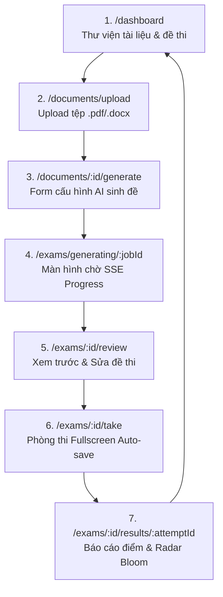

# Kiến Trúc Giao Diện & Bố Cục Màn Hình (Frontend Architecture & UI Specs) - OwnEdu

**Dự án**: OwnEdu  
**Công nghệ Nền tảng**:
- **Build Tool**: Vite 5+ (Khởi động siêu tốc, HMR)
- **Framework**: React 18+ (TypeScript)
- **CSS Framework**: TailwindCSS 3.4+ (Utility-First Styling)
- **Routing**: `react-router-dom` v6
- **Quản lý Trạng thái**: Zustand (Client Session Store) & TanStack Query v5 (Server Cache)
- **Thư viện Icon**: `lucide-react`
- **Biểu đồ**: `recharts` (Radar Chart Bloom)
**Phiên bản**: 2.0.0 (Cập nhật Chuẩn Công nghệ: Vite + React + TailwindCSS)  
**Tài liệu liên quan**:
- [system-architecture.md](file:///C:/Nexis/ownedu/docs/_architecture/system-architecture.md)
- [api-contracts.md](file:///C:/Nexis/ownedu/docs/_architecture/api-contracts.md)
- [database-design.md](file:///C:/Nexis/ownedu/docs/_architecture/database-design.md)

---

## 1. Cấu Trúc Dự Án Chuẩn Vite + React + TailwindCSS

```text
ownedu-frontend/
├── index.html
├── vite.config.ts               # Cấu hình Vite (Proxy /api sang Node.js Gateway :3000)
├── tailwind.config.js           # Bảng màu chủ đạo & mở rộng breakpoint
├── postcss.config.js
├── package.json
├── src/
│   ├── main.tsx                 # Điểm khởi động ứng dụng
│   ├── App.tsx                  # Khởi tạo React Router & React Query Provider
│   ├── index.css                # @tailwind base; components; utilities;
│   ├── routes/
│   │   └── index.tsx            # Định nghĩa toàn bộ Route
│   ├── pages/                   # Các trang chức năng chính
│   │   ├── DashboardPage.tsx
│   │   ├── DocumentUploadPage.tsx
│   │   ├── ExamGeneratePage.tsx
│   │   ├── ExamWaitingPage.tsx  # Kết nối SSE stream tiến độ AI
│   │   ├── ExamReviewPage.tsx   # Xem trước & tinh chỉnh đề
│   │   ├── ExamRoomPage.tsx     # Phòng thi trực tuyến Fullscreen
│   │   └── ExamResultPage.tsx   # Báo cáo điểm & Radar Bloom
│   ├── components/
│   │   ├── layout/
│   │   │   ├── Navbar.tsx
│   │   │   └── ExamHeader.tsx
│   │   ├── exam/
│   │   │   ├── CountdownTimer.tsx
│   │   │   ├── QuestionPalette.tsx
│   │   │   ├── QuestionViewer.tsx
│   │   │   ├── MCQOptionsGroup.tsx
│   │   │   ├── EssayEditor.tsx
│   │   │   └── SubmitModal.tsx
│   │   └── results/
│   │       ├── ScoreHeroCard.tsx
│   │       ├── BloomRadarChart.tsx
│   │       └── RubricFeedbackCard.tsx
│   ├── store/
│   │   └── examStore.ts         # Zustand store (quản lý state phòng thi)
│   └── services/
│       └── apiClient.ts         # Axios instance (gắn JWT Header)
```

---

## 2. Bảng Màu Thiết Kế Với TailwindCSS (`tailwind.config.js`)

```javascript
/** @type {import('tailwindcss').Config} */
export default {
  content: ["./index.html", "./src/**/*.{js,ts,jsx,tsx}"],
  theme: {
    extend: {
      colors: {
        brand: {
          50: '#eef2ff',
          100: '#e0e7ff',
          500: '#6366f1', // Indigo hiện đại
          600: '#4f46e5',
          700: '#4338ca',
        },
        exam: {
          answered: '#10b981', // Emerald xanh lá: Đã làm
          flagged: '#f59e0b',  // Amber vàng cam: Cắm cờ
          active: '#3b82f6',   // Blue: Câu đang chọn
          unanswered: '#e2e8f0', // Slate xám: Chưa làm
        }
      }
    },
  },
  plugins: [],
}
```

---

## 3. Bản Đồ Màn Hình & Luồng Điều Hướng (Screen Flow)



---

## 4. Bố Cục Màn Hình Phòng Thi & Sử Dụng Lớp Tailwind (`ExamRoomPage.tsx`)

Màn hình áp dụng bố cục **Fullscreen Focus**, ẩn thanh menu chính, chia lưới `grid-cols-12` (8 cột câu hỏi, 4 cột bảng điều hướng).

```
+-----------------------------------------------------------------------------------------------+
| Header (bg-white border-b px-6 py-4 flex items-center justify-between shadow-sm):             |
| [OwnEdu Logo]   Đề thi: Kiến trúc Microservices       [Đã tự động lưu 14:32:05 ✓]   [00:42:15 ⏱] |
+-----------------------------------------------------------------------------------------------+
| Main Body (grid grid-cols-12 h-[calc(100vh-73px)] overflow-hidden):                           |
|                                                                                               |
| CỘT TRÁI - NỘI DUNG CÂU HỎI (col-span-8 p-8 overflow-y-auto bg-slate-50):                     |
|                                                                                               |
| <div className="bg-white rounded-xl p-6 shadow-sm border border-slate-200">                  |
|   <div className="flex items-center justify-between mb-4">                                    |
|     <span className="text-lg font-bold text-slate-800">Câu 02 / 17</span>                     |
|     <span className="px-3 py-1 bg-indigo-50 text-indigo-700 rounded-full text-xs font-semibold">|
|       Mức độ: VẬN DỤNG - Điểm: 2.5đ                                                           |
|     </span>                                                                                   |
|   </div>                                                                                      |
|   <p className="text-slate-700 leading-relaxed mb-6 font-medium">                             |
|     Hãy phân tích ưu và nhược điểm của việc tách riêng Document Service và AI Worker Service  |
|     qua Message Queue thay vì gọi đồng bộ qua REST API. Đưa ra ví dụ thực tế.                 |
|   </p>                                                                                        |
|                                                                                               |
|   <!-- KHUNG SOẠN THẢO TỰ LUẬN HOẶC PHƯƠNG ÁN TRẮC NGHIỆM -->                                 |
|   <textarea                                                                                   |
|     className="w-full h-64 p-4 border border-slate-300 rounded-lg focus:ring-2               |
|                focus:ring-brand-500 focus:border-transparent resize-none leading-relaxed"    |
|     placeholder="Nhập câu trả lời tự luận của bạn tại đây..."                                 |
|   />                                                                                          |
|                                                                                               |
|   <div className="flex items-center justify-between mt-4 text-xs text-slate-500">            |
|     <span>Số từ: 248 từ</span>                                                                |
|     <span className="text-emerald-600 flex items-center gap-1 font-medium">                   |
|       <CheckCircle2 className="w-3.5 h-3.5" /> Đã tự động lưu nháp                            |
|     </span>                                                                                   |
|   </div>                                                                                      |
| </div>                                                                                        |
|                                                                                               |
| <div className="flex items-center justify-between mt-6">                                      |
|   <button className="flex items-center gap-2 px-4 py-2 border rounded-lg text-slate-700 ...">  |
|     <Flag className="w-4 h-4 text-amber-500" /> Đánh dấu xem lại                              |
|   </button>                                                                                   |
|   <div className="flex gap-3">                                                                |
|     <button className="px-5 py-2 border rounded-lg hover:bg-slate-100">Câu trước</button>      |
|     <button className="px-5 py-2 bg-brand-600 text-white rounded-lg hover:bg-brand-700">      |
|       Câu tiếp theo                                                                           |
|     </button>                                                                                 |
|   </div>                                                                                      |
| </div>                                                                                        |
|                                                                                               |
| CỘT PHẢI - QUESTION PALETTE (col-span-4 p-6 bg-white border-l border-slate-200 flex flex-col): |
|                                                                                               |
| <h3 className="font-bold text-slate-800 mb-4">Danh sách câu hỏi</h3>                          |
| <div className="grid grid-cols-5 gap-2.5 mb-6">                                              |
|   <!-- Ô số 1: Đã làm -->                                                                     |
|   <button className="h-10 rounded-lg bg-emerald-500 text-white font-bold">01</button>        |
|   <!-- Ô số 2: Đang chọn -->                                                                 |
|   <button className="h-10 rounded-lg bg-white border-2 border-brand-600 text-brand-600 font-bold">02</button> |
|   <!-- Ô số 3: Cắm cờ -->                                                                    |
|   <button className="h-10 rounded-lg bg-amber-500 text-white font-bold relative">             |
|     03 <span className="absolute top-1 right-1 w-2 h-2 bg-red-500 rounded-full"></span>      |
|   </button>                                                                                   |
|   <!-- Ô số 4..N: Chưa làm -->                                                                |
|   <button className="h-10 rounded-lg bg-slate-100 text-slate-600 font-medium hover:bg-slate-200">04</button> |
| </div>                                                                                        |
|                                                                                               |
| <div className="mt-auto pt-6 border-t border-slate-200">                                     |
|   <button className="w-full py-3 bg-emerald-600 hover:bg-emerald-700 text-white font-bold    |
|                      rounded-xl shadow-lg shadow-emerald-200 transition-all">                 |
|     NỘP BÀI THI CHÍNH THỨC                                                                    |
|   </button>                                                                                   |
| </div>                                                                                        |
+-----------------------------------------------------------------------------------------------+
```

---

## 5. Quản Lý Trạng Thái Phòng Thi Bằng Zustand (`examStore.ts`)

Store được viết bằng TypeScript thuần, kết nối hoàn hảo với Axios để thực hiện Auto-save Debounce 2 giây và cơ chế Offline Resilience:

```typescript
import { create } from 'zustand';
import axios from 'axios';

interface AnswerItem {
  questionId: string;
  type: 'MCQ' | 'ESSAY';
  selectedOption?: string;
  essayText?: string;
  isFlagged: boolean;
  isDirty: boolean;
}

interface ExamState {
  attemptId: string | null;
  expiresAt: string | null;
  timeRemainingSeconds: number;
  currentIndex: number;
  answers: Record<string, AnswerItem>;
  isSyncing: boolean;
  lastSavedAt: string | null;
  isOffline: boolean;

  // Actions
  initSession: (attemptId: string, expiresAt: string, initialAnswers: Record<string, any>) => void;
  selectOption: (questionId: string, optionKey: string) => void;
  updateEssayText: (questionId: string, text: string) => void;
  toggleFlag: (questionId: string) => void;
  goToQuestion: (index: number) => void;
  saveAnswerToServer: (questionId: string) => Promise<void>;
  setOfflineStatus: (isOffline: boolean) => void;
}

let debounceTimer: NodeJS.Timeout | null = null;

export const useExamStore = create<ExamState>((set, get) => ({
  attemptId: null,
  expiresAt: null,
  timeRemainingSeconds: 0,
  currentIndex: 0,
  answers: {},
  isSyncing: false,
  lastSavedAt: null,
  isOffline: !navigator.onLine,

  initSession: (attemptId, expiresAt, initialAnswers) => {
    set({ attemptId, expiresAt, answers: initialAnswers });
  },

  selectOption: (questionId, optionKey) => {
    set((state) => ({
      answers: {
        ...state.answers,
        [questionId]: {
          ...state.answers[questionId],
          questionId,
          type: 'MCQ',
          selectedOption: optionKey,
          isDirty: true,
        },
      },
    }));
    // Trắc nghiệm: Gửi lưu tức thì lên Express Backend
    get().saveAnswerToServer(questionId);
  },

  updateEssayText: (questionId, text) => {
    set((state) => ({
      answers: {
        ...state.answers,
        [questionId]: {
          ...state.answers[questionId],
          questionId,
          type: 'ESSAY',
          essayText: text,
          isDirty: true,
        },
      },
    }));

    // Tự luận: Debounce 2000ms trước khi gửi PUT
    if (debounceTimer) clearTimeout(debounceTimer);
    debounceTimer = setTimeout(() => {
      get().saveAnswerToServer(questionId);
    }, 2000);
  },

  toggleFlag: (questionId) => {
    set((state) => {
      const current = state.answers[questionId];
      return {
        answers: {
          ...state.answers,
          [questionId]: {
            ...current,
            isFlagged: !current?.isFlagged,
          },
        },
      };
    });
  },

  goToQuestion: (index) => set({ currentIndex: index }),

  saveAnswerToServer: async (questionId) => {
    const { attemptId, answers, isOffline } = get();
    const item = answers[questionId];
    if (!attemptId || !item) return;

    if (isOffline) {
      // Lưu tạm vào localStorage nếu đang mất mạng
      localStorage.setItem(`offline_attempt_${attemptId}`, JSON.stringify(answers));
      return;
    }

    try {
      set({ isSyncing: true });
      await axios.put(`/api/v1/attempts/${attemptId}/answers/${questionId}`, {
        answer_type: item.type,
        selected_option: item.selectedOption || null,
        essay_text: item.essayText || null,
      });
      set({ 
        isSyncing: false, 
        lastSavedAt: new Date().toLocaleTimeString('vi-VN'),
        answers: {
          ...get().answers,
          [questionId]: { ...item, isDirty: false }
        }
      });
    } catch (err) {
      set({ isSyncing: false });
    }
  },

  setOfflineStatus: (isOffline) => set({ isOffline }),
}));
```
