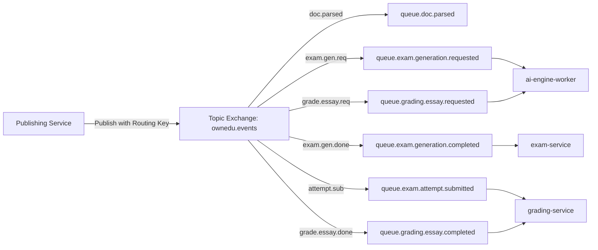

# Đặc tả Hàng đợi & Sự kiện Phân tán (Microservices Event Bus) - OwnEdu

**Dự án**: OwnEdu  
**Phiên bản**: 1.0.0  
**Tài liệu liên quan**:
- [system-architecture.md](file:///C:/Nexis/ownedu/docs/_architecture/system-architecture.md)

---

## 1. Kiến trúc Trao đổi Sự kiện (Event-Driven Broker Topology)

Hệ thống sử dụng RabbitMQ làm Message Broker chính với Topic Exchange: `ownedu.events`.



---

## 2. Danh mục Sự kiện Toàn hệ thống (Domain Events Catalog)

### 2.1. `document.parsed`
- **Nguồn phát (Publisher)**: `document-service`
- **Bên nhận (Consumers)**: `ai-engine-worker`, `exam-service`
- **Mục đích**: Thông báo tài liệu học tập đã bóc tách xong các chunks nội dung, sẵn sàng để phục vụ sinh câu hỏi.
- **Routing Key**: `document.event.parsed`
- **Payload Schema**:
```json
{
  "event_id": "evt_001",
  "event_type": "document.parsed",
  "occurred_at": "2026-09-18T23:05:00.000Z",
  "data": {
    "document_id": "doc_8f9c2d1e-a4b5-4c6d-8e7f-1a2b3c4d5e6f",
    "user_id": "usr_12345",
    "filename": "Giao_trinh_Kien_truc_Phan_mem.pdf",
    "total_chunks": 42,
    "total_characters": 54200
  }
}
```

---

### 2.2. `exam.generation.requested`
- **Nguồn phát**: `exam-service`
- **Bên nhận**: `ai-engine-worker`
- **Mục đích**: Yêu cầu AI Worker tổng hợp dữ liệu chunks và gọi LLM tạo đề thi hỗn hợp.
- **Routing Key**: `exam.event.generation_requested`
- **Payload Schema**:
```json
{
  "event_id": "evt_002",
  "event_type": "exam.generation.requested",
  "occurred_at": "2026-09-18T23:10:00.000Z",
  "data": {
    "job_id": "job_9988",
    "exam_id": "exam_91827364-55aa-44bb-33cc-221100aabbcc",
    "document_id": "doc_8f9c2d1e-a4b5-4c6d-8e7f-1a2b3c4d5e6f",
    "user_id": "usr_12345",
    "mcq_count": 15,
    "essay_count": 2,
    "bloom_levels": ["REMEMBER", "UNDERSTAND", "APPLY", "ANALYZE"],
    "target_audience": "UNIVERSITY"
  }
}
```

---

### 2.3. `exam.generation.completed`
- **Nguồn phát**: `ai-engine-worker`
- **Bên nhận**: `exam-service`
- **Mục đích**: Bàn giao bộ câu hỏi (MCQ + Essay kèm Rubric) đã được thẩm định JSON Schema để lưu vào DB đề thi.
- **Routing Key**: `exam.event.generation_completed`
- **Payload Schema**:
```json
{
  "event_id": "evt_003",
  "event_type": "exam.generation.completed",
  "occurred_at": "2026-09-18T23:10:42.000Z",
  "data": {
    "job_id": "job_9988",
    "exam_id": "exam_91827364-55aa-44bb-33cc-221100aabbcc",
    "status": "SUCCESS",
    "total_questions": 17,
    "duration_seconds": 42
  }
}
```

---

### 2.4. `exam.attempt.submitted`
- **Nguồn phát**: `exam-service`
- **Bên nhận**: `grading-service`
- **Mục đích**: Bàn giao toàn bộ bài làm của thí sinh (các lựa chọn trắc nghiệm và bài viết tự luận) sang phân hệ chấm điểm.
- **Routing Key**: `exam.attempt.submitted`
- **Payload Schema**:
```json
{
  "event_id": "evt_004",
  "event_type": "exam.attempt.submitted",
  "occurred_at": "2026-09-18T23:45:00.000Z",
  "data": {
    "attempt_id": "att_11223344-aabb-ccdd-eeff-001122334455",
    "exam_id": "exam_91827364-55aa-44bb-33cc-221100aabbcc",
    "user_id": "usr_998877",
    "answers": [...]
  }
}
```

---

### 2.5. `grading.essay.requested`
- **Nguồn phát**: `grading-service`
- **Bên nhận**: `ai-engine-worker`
- **Mục đích**: Yêu cầu AI Worker thực hiện chấm điểm bài viết tự luận theo barem rubric.
- **Routing Key**: `grading.event.essay_requested`
- **Payload Schema**:
```json
{
  "event_id": "evt_005",
  "event_type": "grading.essay.requested",
  "occurred_at": "2026-09-18T23:45:02.000Z",
  "data": {
    "attempt_id": "att_11223344-aabb-ccdd-eeff-001122334455",
    "question_id": "q_02",
    "student_text": "Tách riêng qua Message Queue giúp giảm tải...",
    "benchmark_answer": "...",
    "rubric": [...]
  }
}
```

---

### 2.6. `grading.essay.completed`
- **Nguồn phát**: `ai-engine-worker`
- **Bên nhận**: `grading-service`
- **Mục đích**: Trả về kết quả điểm số từng tiêu chí rubric và nhận xét sư phạm chi tiết.
- **Routing Key**: `grading.event.essay_completed`
- **Payload Schema**:
```json
{
  "event_id": "evt_006",
  "event_type": "grading.essay.completed",
  "occurred_at": "2026-09-18T23:45:20.000Z",
  "data": {
    "attempt_id": "att_11223344-aabb-ccdd-eeff-001122334455",
    "question_id": "q_02",
    "earned_points": 2.0,
    "max_points": 2.5,
    "rubric_evaluations": [...]
  }
}
```

---

## 3. Chính sách Xử lý Sự cố & Dead-Letter Queue (DLQ Strategy)

1. **Retry Backoff**:
   - Nếu worker xử lý thất bại do lỗi mạng hoặc LLM quá tải: Áp dụng Exponential Backoff với độ trễ: lần 1 (5s), lần 2 (15s), lần 3 (30s).
2. **Dead-Letter Queue (DLQ)**:
   - Sau 3 lần retry không thành công, message được tự động định tuyến sang exchange `ownedu.dlx` và lưu vào hàng đợi `queue.dead_letter`.
   - Hệ thống kích hoạt Alert gửi tới kênh DevOps Slack/Telegram để điều tra.
3. **Idempotency Key**:
   - Mọi message đều có `event_id` duy nhất. Consumer lưu trữ `processed_event_ids` trong Redis với TTL 24h để đảm bảo cơ chế Exactly-Once Processing, không chấm 2 lần hoặc sinh 2 lần nếu message bị giao lặp lại.
