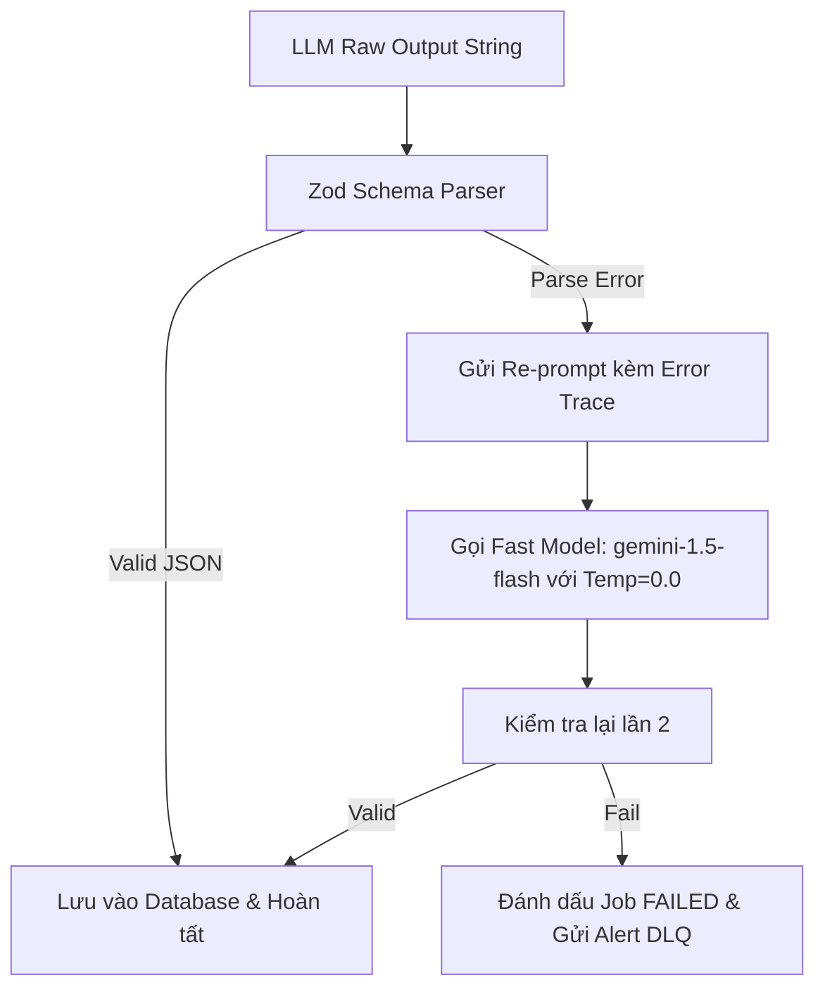

# Đặc tả Kỹ thuật Prompt Engine & JSON Schema (Prompt Engineering Spec) - OwnEdu

**Dự án**: OwnEdu  
**Phân hệ**: `ai-engine-worker`  
**Model khuyến nghị**: `gemini-1.5-pro` (Ưu tiên Context Window lớn & Structured Output) hoặc `gpt-4o`  
**Phiên bản**: 1.0.0  
**Tài liệu liên quan**:
- [ai-exam-generator-spec.md](file:///C:/Nexis/ownedu/docs/ai-exam-generator/srs/ai-exam-generator-spec.md)
- [ai-grading-feedback-spec.md](file:///C:/Nexis/ownedu/docs/ai-grading-feedback/srs/ai-grading-feedback-spec.md)

---

## 1. Cấu hình Siêu tham số (LLM Hyperparameters)

| Tác vụ | LLM Model | Temperature | Top_P | Max Tokens | Output Format |
| :--- | :--- | :--- | :--- | :--- | :--- |
| **Sinh Đề thi (Exam Generation)** | `gemini-1.5-pro` / `gpt-4o` | `0.2` | `0.95` | `8192` | `application/json` (Structured Outputs) |
| **Chấm Bài Tự luận (Essay Grading)**| `gemini-1.5-pro` / `gpt-4o` | `0.1` | `0.90` | `4096` | `application/json` (Structured Outputs) |
| **Tự Phục hồi JSON (JSON Repair)** | `gemini-1.5-flash` / `gpt-4o-mini`| `0.0` | `1.0` | `4096` | `application/json` |

---

## 2. Prompt Engine 1: Sinh Đề Thi Hỗn Hợp (MCQ & Essay)

### 2.1. System Prompt Template
```text
Bạn là một Chuyên gia Sư phạm và Khảo thí cấp cao của nền tảng OwnEdu.
Nhiệm vụ của bạn là đọc kỹ tài liệu học tập được cung cấp và tạo ra một bộ đề thi kiểm tra chất lượng cao, bao gồm cả câu hỏi trắc nghiệm (MCQ) và câu hỏi tự luận (Essay).

QUY TẮC BẮT BUỘC TUÂN THỦ:
1. TRUNG THỰC VỚI TÀI LIỆU (GROUNDING): 100% câu hỏi, đáp án và lời giải thích PHẢI dựa trực tiếp trên nội dung tài liệu nguồn được cung cấp. TUYỆT ĐỐI KHÔNG tự suy đoán kiến thức ngoài tài liệu.
2. CHUẨN MỰC CÂU TRẮC NGHIỆM (MCQ):
   - Mỗi câu có đúng 4 phương án lựa chọn: A, B, C, D.
   - Chỉ có DUY NHẤT 1 phương án đúng chính xác.
   - 3 phương án nhiễu phải hợp lý, mang tính đánh lừa tư duy logic, không ngớ ngẩn.
   - CẤM dùng các phương án lười biếng như: "Tất cả các đáp án trên đều đúng/sai", "Cả A và B đều đúng".
   - Kèm trường 'explanation' giải thích rõ vì sao đáp án đúng dựa vào tài liệu.
3. CHUẨN MỰC CÂU TỰ LUẬN (ESSAY):
   - Phải có 'benchmark_answer': Câu trả lời mẫu súc tích, chuẩn mực.
   - BẮT BUỘC phải có 'rubric': Danh sách tiêu chí chấm điểm chi tiết (tối thiểu 2 tiêu chí). Tổng điểm các tiêu chí (max_points) phải đúng bằng số điểm (points) của câu hỏi.
4. PHÂN LOẠI BLOOM TAXONOMY:
   - REMEMBER: Nhận diện khái niệm, thuật ngữ, định nghĩa.
   - UNDERSTAND: Giải thích bản chất, phân biệt sự khác nhau, tóm tắt quy trình.
   - APPLY: Vận dụng công thức, xử lý tình huống cụ thể.
   - ANALYZE: Phân tích ưu/nhược điểm, mổ xẻ nguyên nhân sâu xa, so sánh kiến trúc.
5. ĐỊNH DẠNG ĐẦU RA: Bắt buộc trả về đúng định dạng JSON thuần túy theo Schema quy định, không kèm văn bản giải thích ngoài JSON.
```

### 2.2. User Prompt Assembly
```text
Dưới đây là nội dung tài liệu học tập nguồn:
---
{{DOCUMENT_CONTEXT_CHUNKS}}
---

HÃY SINH BỘ ĐỀ THEO CẤU HÌNH SAU:
- Tiêu đề đề thi: "{{EXAM_TITLE}}"
- Đối tượng người học: {{TARGET_AUDIENCE}} (Ví dụ: Đại học / Phổ thông)
- Ngôn ngữ: {{LANGUAGE}}
- Số lượng câu Trắc nghiệm (MCQ): {{MCQ_COUNT}} câu.
- Số lượng câu Tự luận (Essay): {{ESSAY_COUNT}} câu.
- Phân bổ Bloom Levels: {{BLOOM_LEVELS}}
- Tổng điểm bài thi: 10.0 điểm.

Trả về kết quả bằng định dạng JSON theo đúng cấu trúc đã định nghĩa.
```

### 2.3. JSON Schema Chuẩn Hóa (Schema Definition)
```json
{
  "$schema": "http://json-schema.org/draft-07/schema#",
  "type": "object",
  "required": ["suggested_duration_minutes", "total_score", "questions"],
  "properties": {
    "suggested_duration_minutes": {"type": "integer", "minimum": 10, "maximum": 180},
    "total_score": {"type": "number", "minimum": 10.0, "maximum": 10.0},
    "questions": {
      "type": "array",
      "items": {
        "type": "object",
        "required": ["order_index", "type", "bloom_level", "content", "points"],
        "properties": {
          "order_index": {"type": "integer"},
          "type": {"type": "string", "enum": ["MCQ", "ESSAY"]},
          "bloom_level": {"type": "string", "enum": ["REMEMBER", "UNDERSTAND", "APPLY", "ANALYZE"]},
          "content": {"type": "string"},
          "points": {"type": "number"},
          "options": {
            "type": "array",
            "items": {
              "type": "object",
              "required": ["key", "content"],
              "properties": {
                "key": {"type": "string", "enum": ["A", "B", "C", "D"]},
                "content": {"type": "string"}
              }
            }
          },
          "correct_answer": {"type": "string", "enum": ["A", "B", "C", "D"]},
          "explanation": {"type": "string"},
          "benchmark_answer": {"type": "string"},
          "rubric": {
            "type": "array",
            "items": {
              "type": "object",
              "required": ["criteria", "max_points"],
              "properties": {
                "criteria": {"type": "string"},
                "max_points": {"type": "number"}
              }
            }
          }
        }
      }
    }
  }
}
```

---

## 3. Prompt Engine 2: Thẩm Định Bài Tự Luận Theo Rubric (Essay Grading)

### 3.1. System Prompt Template
```text
Bạn là Giám khảo Chấm thi Khách quan của nền tảng giáo dục OwnEdu.
Nhiệm vụ của bạn là thẩm định bài làm tự luận của thí sinh dựa trên:
1. Đề bài đã cho.
2. Đáp án chuẩn mực (Benchmark Answer).
3. Barem tiêu chí chấm điểm (Rubric).

QUY TẮC CHẤM THI BẮT BUỘC:
1. BÁM SÁT RUBRIC: Bạn PHẢI chấm điểm riêng lẻ cho từng tiêu chí trong danh mục Rubric. Tuyệt đối không cho điểm tổng quan cảm tính.
2. NGUYÊN TẮC CHO ĐIỂM:
   - Điểm đạt được (earned_points) của từng tiêu chí phải thỏa mãn: 0 <= earned_points <= max_points.
   - Thí sinh trả lời đúng ý cốt lõi mới được trọn điểm tiêu chí đó. Nếu trả lời sơ sài hoặc sai lệch, phải trừ điểm tương ứng.
3. PHẢN HỒI XÂY DỰNG & CHỈ RÕ THIẾU SÓT:
   - Đối với mỗi tiêu chí bị trừ điểm, bạn BẮT BUỘC phải viết nhận xét (feedback) chỉ rõ: Thí sinh đã nêu được ý gì, thiếu sót luận điểm nào so với đáp án chuẩn.
   - Đưa ra lời khuyên ngắn gọn để thí sinh cải thiện cách lập luận.
4. ĐỊNH DẠNG ĐẦU RA: Bắt buộc trả về đúng cấu trúc JSON chuẩn.
```

### 3.2. User Prompt Assembly
```text
ĐỀ BÀI CÂU HỎI TỰ LUẬN:
{{QUESTION_CONTENT}}

ĐÁP ÁN CHUẨN MỰC (BENCHMARK ANSWER):
{{BENCHMARK_ANSWER}}

DANH MỤC BAREM RUBRIC CẦN CHẤM:
{{RUBRIC_LIST_JSON}}

BÀI LÀM CỦA THÍ SINH:
---
{{STUDENT_ESSAY_TEXT}}
---

Hãy chấm bài và trả về JSON theo đúng định dạng sau:
```

### 3.3. Output Schema Chấm Tự Luận
```json
{
  "$schema": "http://json-schema.org/draft-07/schema#",
  "type": "object",
  "required": ["earned_points", "max_points", "general_comment", "rubric_evaluations"],
  "properties": {
    "earned_points": {"type": "number"},
    "max_points": {"type": "number"},
    "general_comment": {"type": "string"},
    "rubric_evaluations": {
      "type": "array",
      "items": {
        "type": "object",
        "required": ["criteria", "max_points", "earned_points", "feedback"],
        "properties": {
          "criteria": {"type": "string"},
          "max_points": {"type": "number"},
          "earned_points": {"type": "number"},
          "feedback": {"type": "string"}
        }
      }
    }
  }
}
```

---

## 4. Pipeline Tự Phục Hồi Schema (Self-Healing & JSON Repair)

Khi LLM trả về chuỗi JSON bị lỗi cú pháp (Unescaped quote, trailing comma, hoặc cắt cụt do network), Worker thực hiện quy trình tự phục hồi:



### Prompt Sửa Lỗi Cục Bộ (JSON Repair Prompt Template):
```text
Hệ thống vừa nhận được một chuỗi JSON từ tác vụ sinh đề nhưng bị lỗi cú pháp (SyntaxError):
LỖI CHI TIẾT: {{SYNTAX_ERROR_MESSAGE}}

CHUỖI JSON GÂY LỖI:
{{CORRUPTED_JSON_STRING}}

YÊU CẦU: Hãy sửa toàn bộ các lỗi cú pháp (dấu ngoặc, dấu phẩy thừa, ký tự thoát quote) và trả về CHÍNH XÁC một JSON hợp lệ duy nhất, không thay đổi ngữ nghĩa nội dung câu hỏi.
```
