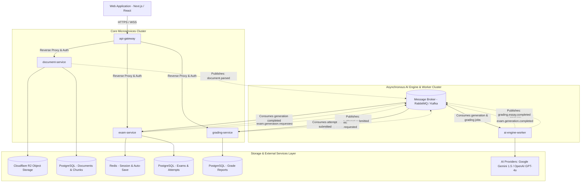

# Kiến trúc Hệ thống Microservices Toàn diện (System Architecture) - OwnEdu

**Dự án**: OwnEdu (Nền tảng Học tập & Đánh giá Năng lực Tự động bằng AI)  
**Phiên bản**: 1.0.0  
**Ngày cập nhật**: 2026-09-18  
**Tài liệu liên quan**:
- [project-brief.md](file:///C:/Nexis/ownedu/docs/_product/project-brief.md)
- [discovery.md](file:///C:/Nexis/ownedu/docs/_product/discovery.md)
- [microservices-event-bus.md](file:///C:/Nexis/ownedu/docs/_architecture/microservices-event-bus.md)

---

## 1. Bản đồ Ranh giới Microservices (Service Boundaries & Responsibilities)

Hệ thống OwnEdu được phân tách theo nguyên tắc Domain-Driven Design (DDD) thành 5 dịch vụ độc lập:

---

## 2. Chi tiết Đặc tả Từng Dịch vụ

### 2.1. `api-gateway`
- **Công nghệ đề xuất**: Kong Gateway / Go (Fiber) / Node.js (Fastify)
- **Trách nhiệm chính**:
  - Điểm tiếp nhận duy nhất cho toàn bộ traffic từ Web / Mobile.
  - Xác thực JWT token, phân quyền RBAC (Học sinh, Sinh viên, Giáo viên, Admin).
  - Rate Limiting và DDoS protection (chống spam sinh đề và auto-save).
  - Định tuyến thông minh (Routing) và Terminate SSL/TLS.

### 2.2. `document-service` (Phân hệ `doc-ingestion`)
- **Trách nhiệm chính**:
  - Quản lý vòng đời tài liệu học tập (`.pdf`, `.docx` $\le 25$MB).
  - Sinh S3/R2 Presigned Upload URL cho Client tải tệp trực tiếp.
  - Xử lý bóc tách cấu trúc (Heading, Paragraph, Table, Metadata).
  - Chunking thuật toán RAG (1000 - 1500 ký tự, overlap 150 ký tự) để phục vụ Prompting.
  - Phát hành sự kiện `document.parsed`.

### 2.3. `ai-engine-worker` (Phân hệ `ai-exam-generator` & `ai-grading-feedback`)
- **Trách nhiệm chính**:
  - Không mở cổng public ra ngoài; chỉ giao tiếp nội bộ qua Message Queue.
  - Chịu trách nhiệm toàn bộ logic kết nối LLM (Google Gemini, OpenAI).
  - Thực thi kỹ thuật Prompt Engineering: Context Injection, Structured JSON Schema Outputs, Bloom Taxonomy prompt.
  - Thẩm định bài thi tự luận theo tiêu chí Rubric.
  - Cơ chế tự phục hồi (Self-Healing / JSON Repair retry $\le 2$).

### 2.4. `exam-service` (Phân hệ `interactive-testing`)
- **Trách nhiệm chính**:
  - Quản lý đề thi (Exam metadata, danh sách câu hỏi, trạng thái `PUBLISHED`).
  - Quản lý phòng thi trực tuyến (Exam Session / Attempt).
  - Server-Authoritative Timing (Khóa thời gian kết thúc, tính bù trừ Grace Period 30s).
  - High-frequency Auto-save: Ghi tạm vào Redis và đồng bộ PostgreSQL để đảm bảo Zero Data Loss.
  - Phát hành sự kiện `exam.attempt.submitted`.

### 2.5. `grading-service` (Phân hệ `ai-grading-feedback`)
- **Trách nhiệm chính**:
  - Chấm điểm trắc nghiệm tức thì (Deterministic MCQ Grader < 50ms).
  - Tiếp nhận kết quả chấm tự luận từ `ai-engine-worker`.
  - Tổng hợp điểm số về thang 10 chuẩn hóa.
  - Tính toán phân tích năng lực theo Bloom Taxonomy (Radar chart).
  - Quản lý quyền can thiệp & ghi đè điểm của Giáo viên (Teacher Grade Override) kèm Audit Trail.

---

## 3. Chiến lược Lưu trữ Dữ liệu (Database per Service Pattern)

Để đảm bảo tính độc lập và khả năng scale riêng lẻ của kiến trúc Microservices:
1. Mỗi microservice sở hữu một Database Schema độc lập, **tuyệt đối không chia sẻ kết nối DB trực tiếp** giữa các dịch vụ.
2. Mọi truy vấn chéo thông tin bắt buộc thực hiện qua gRPC / REST nội bộ hoặc thông qua Event-Driven Messaging.
3. Object Storage (Cloudflare R2 / AWS S3) dùng chung bucket phân cấp theo prefix: `/{tenant_id}/{user_id}/documents/{doc_id}/`.
