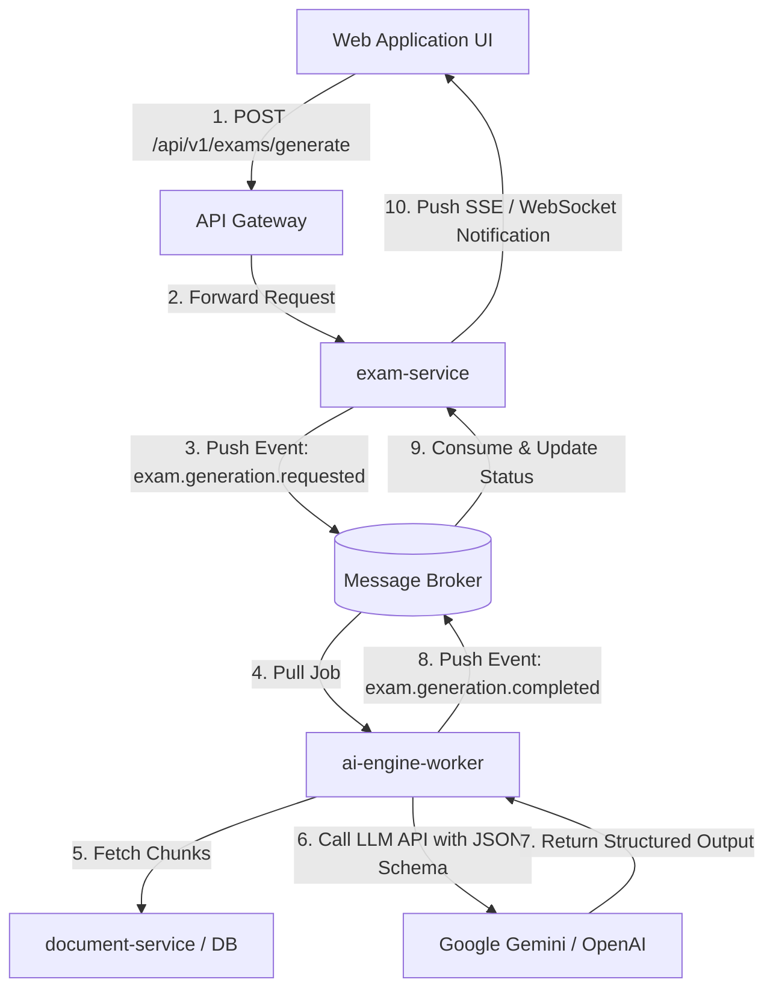
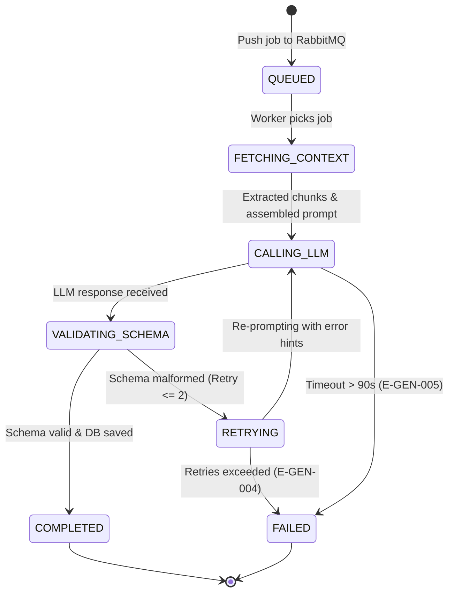

# Đặc tả Yêu cầu Kỹ thuật Hệ thống (SRS) - ai-exam-generator

**Phân hệ**: `ai-exam-generator`  
**Microservice phụ trách**: `ai-engine-worker` (phối hợp cùng `document-service` và `exam-service`)  
**Phiên bản**: 1.0.0  
**Trạng thái**: Draft  
**Truy vết (Traceability)**:
- [ai-exam-generator-urd.md](file:///C:/Nexis/ownedu/docs/ai-exam-generator/ai-exam-generator-urd.md)
- [ai-exam-generator-brd.md](file:///C:/Nexis/ownedu/docs/ai-exam-generator/ai-exam-generator-brd.md)

---

## 1. Kiến trúc Tương tác Dịch vụ (Microservice Context)



---

## 2. Danh mục Yêu cầu Chức năng (Functional Requirements)

| Mã FR | Tên Chức năng | Mô tả Nghiệp vụ & Kỹ thuật | Phục vụ URD / BRD |
| :--- | :--- | :--- | :--- |
| **FR-GEN-001** | Tiếp nhận Yêu cầu Tạo Đề | API Gateway & `exam-service` tiếp nhận cấu hình tạo đề (document_id, số câu MCQ, số câu Essay, Bloom taxonomy, time_limit). Kiểm tra hạn ngạch người dùng (`RULE-GEN-004`). | `UR-GEN-001`, `BR-GEN-001` |
| **FR-GEN-002** | RAG Context Aggregator | `ai-engine-worker` truy vấn `document-service` để lấy danh sách chunks nội dung tương ứng. Nếu tài liệu quá dài, thực hiện Semantic Clustering để chọn lọc các đoạn chứa trọng tâm kiến thức. | `UR-GEN-003`, `BR-GEN-002` |
| **FR-GEN-003** | Prompt Engine & Template Assembly | Lắp ghép System Prompt, RAG Context, cấu hình tỷ lệ câu hỏi, quy tắc barem rubric và JSON Schema đầu ra nghiêm ngặt (`RULE-GEN-002`, `003`). | `UR-GEN-002`, `BR-GEN-003` |
| **FR-GEN-004** | Xử lý Bất đồng bộ qua Hàng đợi | Đẩy tác vụ vào RabbitMQ/Redis Stream với Job ID duy nhất. Cho phép tracking trạng thái tiến độ thời gian thực. | `UR-GEN-004`, `RULE-GEN-005` |
| **FR-GEN-005** | Schema Validation & Tự phục hồi | Kiểm tra Payload trả về từ LLM bằng Zod Schema. Nếu vi phạm cấu trúc, tự động trigger re-prompt sửa lỗi cục bộ (JSON repair). | `BR-GEN-002`, `RULE-GEN-003` |
| **FR-GEN-006** | Thông báo Tiến độ Thời gian thực | Cung cấp kênh Server-Sent Events (SSE) `/api/v1/exams/jobs/{job_id}/stream` để cập nhật tiến độ cho Client mà không cần Polling. | `UR-GEN-004` |
| **FR-GEN-007** | Preview & Chỉnh sửa Đề thi | Cung cấp REST endpoint cho phép giáo viên/học sinh chỉnh sửa nội dung câu hỏi, đổi đáp án đúng, tinh chỉnh barem rubric trước khi khóa đề thi. | `UR-GEN-005` |
| **FR-GEN-008** | Khóa & Bàn giao Đề thi cho Phòng thi | Chuyển đổi đề thi hoàn chỉnh sang trạng thái `PUBLISHED`, lưu trữ vào database của `exam-service`, sẵn sàng cho sinh viên bắt đầu làm bài. | `UR-GEN-006` |

---

## 3. Data Contracts & JSON Schema Quy chuẩn

### 3.1. Request Tạo Đề (`POST /api/v1/exams/generate`)
```json
{
  "document_id": "doc_8f9c2d1e-a4b5-4c6d-8e7f-1a2b3c4d5e6f",
  "title": "Kiểm tra Giữa kỳ - Kiến trúc Phần mềm Microservices",
  "config": {
    "mcq_count": 15,
    "essay_count": 2,
    "bloom_levels": ["REMEMBER", "UNDERSTAND", "APPLY", "ANALYZE"],
    "target_audience": "UNIVERSITY",
    "language": "vi",
    "selected_chapter_ids": []
  }
}
```

### 3.2. Output Schema Của AI Worker (Sau khi Parse & Validate)
```json
{
  "exam_id": "exam_91827364-55aa-44bb-33cc-221100aabbcc",
  "document_id": "doc_8f9c2d1e-a4b5-4c6d-8e7f-1a2b3c4d5e6f",
  "title": "Kiểm tra Giữa kỳ - Kiến trúc Phần mềm Microservices",
  "suggested_duration_minutes": 45,
  "total_score": 10.0,
  "questions": [
    {
      "id": "q_01",
      "type": "MCQ",
      "bloom_level": "UNDERSTAND",
      "content": "Trong kiến trúc microservices, cơ chế nào sau đây giải quyết tốt nhất vấn đề phân tán dữ liệu mà không gây khóa dữ liệu tập trung?",
      "points": 0.5,
      "options": [
        {"key": "A", "content": "Two-Phase Commit (2PC)"},
        {"key": "B", "content": "Saga Pattern (Choreography hoặc Orchestration)"},
        {"key": "C", "content": "Shared Database pattern"},
        {"key": "D", "content": "Centralized Locking Service"}
      ],
      "correct_answer": "B",
      "explanation": "Saga Pattern chia transaction thành chuỗi các local transactions kèm compensating actions, phù hợp nhất với hệ thống phân tán không dùng distributed lock."
    },
    {
      "id": "q_02",
      "type": "ESSAY",
      "bloom_level": "ANALYZE",
      "content": "Hãy phân tích ưu và nhược điểm của việc tách riêng Document Service và AI Worker Service qua Message Queue thay vì gọi đồng bộ qua REST API. Đưa ra ví dụ thực tế.",
      "points": 2.5,
      "benchmark_answer": "Tách riêng qua Message Queue giúp giảm tải API Gateway, ngăn ngừa HTTP timeout khi LLM sinh bài lâu (30-60s), tăng khả năng co giãn độc lập (scale AI worker theo số lượng GPU/tác vụ). Nhược điểm là tăng độ phức tạp vận hành và cần cơ chế bất đồng bộ để báo kết quả về UI.",
      "rubric": [
        {
          "criteria": "Phân tích được ít nhất 2 ưu điểm cốt lõi (chống nghẽn HTTP, scale độc lập)",
          "max_points": 1.0
        },
        {
          "criteria": "Chỉ ra được nhược điểm (độ trễ bất đồng bộ, độ phức tạp kiến trúc)",
          "max_points": 0.5
        },
        {
          "criteria": "Lấy được ví dụ minh họa gắn liền với bối cảnh hệ thống thực tế",
          "max_points": 1.0
        }
      ]
    }
  ]
}
```

---

## 4. Máy Trạng Thái Tác vụ Sinh Đề (Exam Generation State Machine)



---

## 5. Ma trận Mã Lỗi Hệ thống (Error Code Catalog)

| Mã Lỗi | HTTP Code | Tên Lỗi | Nguyên nhân & Hành vi Khắc phục |
| :--- | :--- | :--- | :--- |
| **E-GEN-001** | `400 Bad Request` | `INVALID_QUESTION_COUNT` | Số lượng câu hỏi vi phạm `RULE-GEN-001` (MCQ > 50 hoặc Essay > 10). Client sửa lại slider cấu hình. |
| **E-GEN-002** | `422 Unprocessable` | `INSUFFICIENT_CONTEXT` | Tài liệu nguồn quá ngắn (< 300 từ) không đủ tri thức để sinh đủ số lượng câu hỏi yêu cầu. |
| **E-GEN-003** | `429 Too Many Requests`| `TOKEN_QUOTA_EXCEEDED` | Người dùng đã dùng hết lượt sinh đề miễn phí trong ngày (`RULE-GEN-004`). Hiển thị popup nâng cấp. |
| **E-GEN-004** | `502 Bad Gateway` | `LLM_OUTPUT_MALFORMED` | LLM trả về cấu trúc không thể parse sau 2 lần retry. Hệ thống hoàn lại quota và báo cáo bug log. |
| **E-GEN-005** | `504 Gateway Timeout` | `AI_WORKER_TIMEOUT` | Tác vụ vượt quá SLA 90s do AI provider bị nghẽn (`RULE-GEN-005`). |
