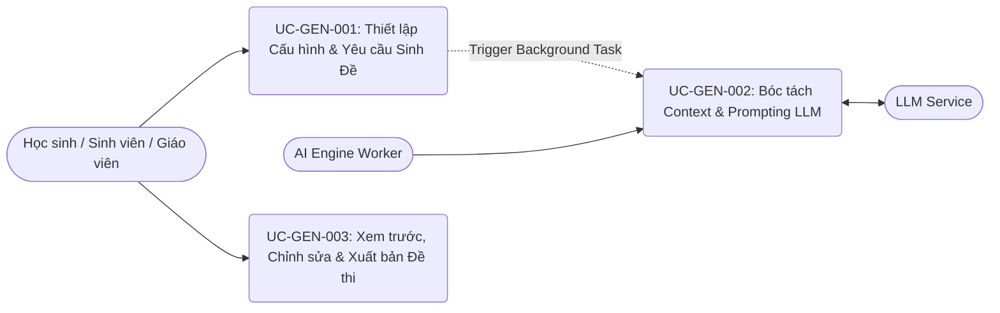

# Danh mục Use Cases - ai-exam-generator

**Phân hệ**: `ai-exam-generator`  
**Microservice**: `ai-engine-worker` / `exam-service`  
**Phiên bản**: 1.0.0  
**Trạng thái**: Draft  
**Truy vết (Traceability)**:
- [ai-exam-generator-urd.md](file:///C:/Nexis/ownedu/docs/ai-exam-generator/ai-exam-generator-urd.md)
- [ai-exam-generator-brd.md](file:///C:/Nexis/ownedu/docs/ai-exam-generator/ai-exam-generator-brd.md)
- [ai-exam-generator-spec.md](file:///C:/Nexis/ownedu/docs/ai-exam-generator/srs/ai-exam-generator-spec.md)

---

## 1. Sơ đồ Tổng quan Use Cases (Use Case Overview)

---

## 2. Bảng Danh mục Chi tiết Use Cases

| Mã Use Case | Tên Use Case | Actor Chính | Mục tiêu Nghiệp vụ | Mã FR Liên kết | Mã Lỗi Tiềm ẩn |
| :--- | :--- | :--- | :--- | :--- | :--- |
| [UC-GEN-001](file:///C:/Nexis/ownedu/docs/ai-exam-generator/usecases/uc-configure-exam-generation.md) | Thiết lập Cấu hình & Yêu cầu Sinh Đề | Người dùng (Học sinh/Giáo viên) | Chọn tài liệu, điều chỉnh số lượng câu MCQ/Essay, Bloom levels, thời gian thi và gửi lệnh tạo đề. | `FR-GEN-001`, `FR-GEN-004` | `E-GEN-001`, `E-GEN-003` |
| [UC-GEN-002](file:///C:/Nexis/ownedu/docs/ai-exam-generator/usecases/uc-ai-prompt-processing.md) | Bóc tách Context & Prompting LLM | Hệ thống (`ai-engine-worker`) | Lấy chunked text, xây dựng prompt theo cấu trúc JSON Schema, gọi LLM, kiểm tra lỗi và validate rubric. | `FR-GEN-002`, `FR-GEN-003`, `FR-GEN-005` | `E-GEN-002`, `E-GEN-004`, `E-GEN-005` |
| [UC-GEN-003](file:///C:/Nexis/ownedu/docs/ai-exam-generator/usecases/uc-review-customize-exam.md) | Xem trước, Chỉnh sửa & Xuất bản Đề | Người dùng (Học sinh/Giáo viên) | Xem lại đề thi được tạo, sửa câu hỏi/đáp án/rubric nếu cần, xuất bản đề để chuẩn bị làm bài hoặc phát cho học sinh. | `FR-GEN-006`, `FR-GEN-007`, `FR-GEN-008` | `E-GEN-001` |
