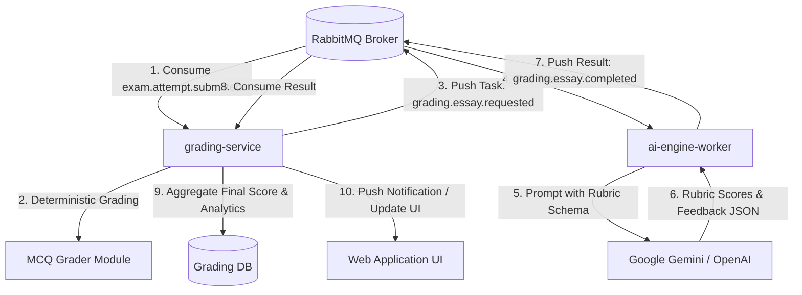
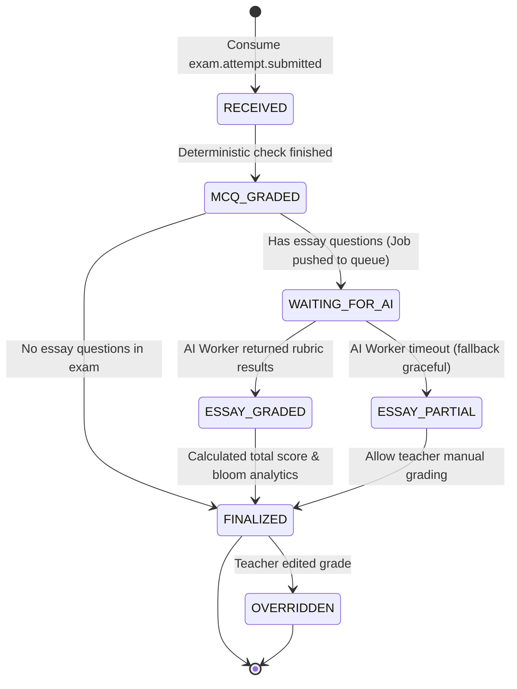

# Đặc tả Yêu cầu Kỹ thuật Hệ thống (SRS) - ai-grading-feedback

**Phân hệ**: `ai-grading-feedback`  
**Microservice phụ trách**: `grading-service` (phối hợp cùng `ai-engine-worker`)  
**Phiên bản**: 1.0.0  
**Trạng thái**: Draft  
**Truy vết (Traceability)**:
- [ai-grading-feedback-urd.md](file:///C:/Nexis/ownedu/docs/ai-grading-feedback/ai-grading-feedback-urd.md)
- [ai-grading-feedback-brd.md](file:///C:/Nexis/ownedu/docs/ai-grading-feedback/ai-grading-feedback-brd.md)

---

## 1. Kiến trúc Phối hợp Dịch vụ (Microservice Architecture)



---

## 2. Danh mục Yêu cầu Chức năng (Functional Requirements)

| Mã FR | Tên Chức năng | Mô tả Nghiệp vụ & Kỹ thuật | Phục vụ URD / BRD |
| :--- | :--- | :--- | :--- |
| **FR-GRADE-001** | Tiếp nhận Bài thi từ Hàng đợi | Lắng nghe event `exam.attempt.submitted` từ RabbitMQ, tạo bản ghi chấm bài `grade_reports` với trạng thái ban đầu `GRADING_MCQ`. | `UR-GRADE-001`, `BR-GRADE-001` |
| **FR-GRADE-002** | Chấm Trắc nghiệm Tức thì | So khớp câu trả lời của thí sinh với đáp án đúng `correct_answer`, tính tổng điểm trắc nghiệm, tạo danh sách giải thích chi tiết trong thời gian < 50ms. | `UR-GRADE-001`, `RULE-GRADE-001` |
| **FR-GRADE-003** | Điều phối Chấm Tự luận AI | Đóng gói bài viết tự luận của thí sinh, câu trả lời chuẩn và danh sách rubric thành message `grading.essay.requested` đẩy vào queue cho `ai-engine-worker`. | `UR-GRADE-002`, `RULE-GRADE-002` |
| **FR-GRADE-004** | Thẩm định Rubric bằng LLM | AI Worker gọi LLM với cấu trúc JSON Schema chấm điểm theo từng tiêu chí, phát hiện các luận điểm thiếu, đối chiếu trích dẫn tài liệu nguồn. | `UR-GRADE-002`, `BR-GRADE-002` |
| **FR-GRADE-005** | Tổng hợp Điểm & Phân tích Bloom | Tính tổng điểm toàn bài (thang 10), phân loại kết quả theo 4 cấp độ nhận thức Bloom, sinh danh sách các chương/trang tài liệu cần ôn tập lại. | `UR-GRADE-003`, `UR-GRADE-004` |
| **FR-GRADE-006** | Truy xuất Báo cáo Kết quả Toàn diện | Cung cấp REST endpoint `GET /api/v1/attempts/{id}/result` trả về toàn bộ bảng điểm, chi tiết từng câu, nhận xét của AI và biểu đồ phân tích. | `UR-GRADE-001`, `UR-GRADE-003` |
| **FR-GRADE-007** | Can thiệp & Điều chỉnh Điểm của Giáo viên | Endpoint `POST /api/v1/attempts/{id}/override-grade` cho phép giáo viên điều chỉnh điểm câu tự luận, cập nhật nhận xét và lưu audit log (`RULE-GRADE-004`). | `UR-GRADE-005`, `BR-GRADE-003` |

---

## 3. Data Contracts & JSON Schemas

### 3.1. Output Chấm Tự luận từ AI Worker
```json
{
  "question_id": "q_02",
  "earned_points": 2.0,
  "max_points": 2.5,
  "general_comment": "Bài viết nắm rất chắc ưu điểm của Message Queue trong việc chống nghẽn và scale độc lập. Tuy nhiên phần ví dụ minh họa thực tế còn sơ sài.",
  "rubric_evaluations": [
    {
      "criteria": "Phân tích được ít nhất 2 ưu điểm (chống nghẽn HTTP, scale độc lập)",
      "earned_points": 1.0,
      "max_points": 1.0,
      "feedback": "Phân tích xuất sắc cả 2 khía cạnh decoupling và elasticity."
    },
    {
      "criteria": "Chỉ ra được nhược điểm (độ trễ bất đồng bộ, độ phức tạp kiến trúc)",
      "earned_points": 0.5,
      "max_points": 0.5,
      "feedback": "Nêu đúng thách thức về eventual consistency."
    },
    {
      "criteria": "Lấy được ví dụ minh họa gắn liền với bối cảnh hệ thống thực tế",
      "earned_points": 0.5,
      "max_points": 1.0,
      "feedback": "Ví dụ nêu còn chung chung, chưa chỉ rõ luồng dữ liệu giữa các microservices cụ thể."
    }
  ]
}
```

### 3.2. Báo cáo Kết quả Bài thi Hoàn chỉnh (`GET /api/v1/attempts/{id}/result`)
```json
{
  "attempt_id": "att_11223344-aabb-ccdd-eeff-001122334455",
  "exam_id": "exam_91827364-55aa-44bb-33cc-221100aabbcc",
  "exam_title": "Kiểm tra Giữa kỳ - Kiến trúc Phần mềm Microservices",
  "student_name": "Nguyễn Văn Nam",
  "status": "COMPLETED",
  "summary": {
    "total_score": 8.5,
    "max_score": 10.0,
    "mcq_score": 6.5,
    "essay_score": 2.0,
    "correct_mcq_count": 13,
    "total_mcq_count": 15,
    "completion_time_minutes": 32.5
  },
  "bloom_analytics": {
    "REMEMBER": {"correct": 5, "total": 5, "percentage": 100},
    "UNDERSTAND": {"correct": 5, "total": 6, "percentage": 83.3},
    "APPLY": {"correct": 3, "total": 4, "percentage": 75.0},
    "ANALYZE": {"earned": 2.0, "max": 2.5, "percentage": 80.0}
  },
  "knowledge_gaps_and_recommendations": [
    {
      "topic": "Saga Pattern trong Microservices",
      "issue": "Nhầm lẫn giữa Choreography Saga và Two-Phase Commit",
      "recommended_study": "Xem lại trang 24-28 trong tài liệu 'Kien-truc-Microservices.pdf'"
    }
  ]
}
```

---

## 4. Máy Trạng Thái Báo Cáo Chấm Điểm (Grading State Machine)



---

## 5. Ma trận Mã Lỗi Hệ thống (Error Code Catalog)

| Mã Lỗi | HTTP Code | Tên Lỗi | Nguyên nhân & Hành vi Khắc phục |
| :--- | :--- | :--- | :--- |
| **E-GRADE-001** | `404 Not Found` | `ATTEMPT_NOT_GRADED_YET` | Thí sinh tra cứu kết quả của phiên thi đang làm dở (`IN_PROGRESS`) chưa nộp bài. |
| **E-GRADE-002** | `504 Gateway Timeout` | `AI_GRADING_TIMEOUT` | AI Worker gặp sự cố khi chấm tự luận; hệ thống kích hoạt chế độ Graceful (`RULE-GRADE-005`). |
| **E-GRADE-003** | `403 Forbidden` | `OVERRIDE_NOT_PERMITTED` | Người dùng cố tình sửa điểm của người khác mà không có quyền Giáo viên sở hữu đề thi. |
