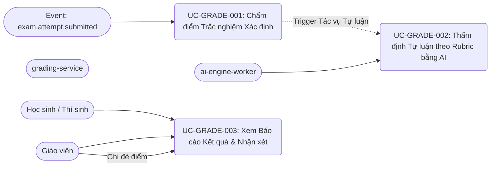

# Danh mục Use Cases - ai-grading-feedback

**Phân hệ**: `ai-grading-feedback`  
**Microservice**: `grading-service` / `ai-engine-worker`  
**Phiên bản**: 1.0.0  
**Trạng thái**: Draft  
**Truy vết (Traceability)**:
- [ai-grading-feedback-urd.md](file:///C:/Nexis/ownedu/docs/ai-grading-feedback/ai-grading-feedback-urd.md)
- [ai-grading-feedback-brd.md](file:///C:/Nexis/ownedu/docs/ai-grading-feedback/ai-grading-feedback-brd.md)
- [ai-grading-feedback-spec.md](file:///C:/Nexis/ownedu/docs/ai-grading-feedback/srs/ai-grading-feedback-spec.md)

---

## 1. Sơ đồ Tổng quan Use Cases (Use Case Overview)

---

## 2. Bảng Danh mục Chi tiết Use Cases

| Mã Use Case | Tên Use Case | Actor Chính | Mục tiêu Nghiệp vụ | Mã FR Liên kết | Mã Lỗi Tiềm ẩn |
| :--- | :--- | :--- | :--- | :--- | :--- |
| [UC-GRADE-001](file:///C:/Nexis/ownedu/docs/ai-grading-feedback/usecases/uc-automated-mcq-grading.md) | Chấm điểm Trắc nghiệm Xác định | Hệ thống (`grading-service`) | So khớp đáp án đã chọn với đáp án đúng, cộng điểm và chuẩn bị giải thích. | `FR-GRADE-001`, `FR-GRADE-002` | `E-GRADE-001` |
| [UC-GRADE-002](file:///C:/Nexis/ownedu/docs/ai-grading-feedback/usecases/uc-ai-essay-rubric-grading.md) | Thẩm định Tự luận theo Rubric bằng AI | Hệ thống (`ai-engine-worker`) | Dùng LLM đối chiếu bài viết thí sinh với rubric, tính điểm từng tiêu chí và sinh feedback. | `FR-GRADE-003`, `FR-GRADE-004` | `E-GRADE-002` |
| [UC-GRADE-003](file:///C:/Nexis/ownedu/docs/ai-grading-feedback/usecases/uc-view-comprehensive-feedback.md) | Xem Báo cáo Kết quả & Nhận xét | Học sinh / Giáo viên | Hiển thị bảng điểm tổng kết, biểu đồ radar Bloom, gợi ý trang ôn tập; cho phép giáo viên ghi đè điểm. | `FR-GRADE-005`, `FR-GRADE-006`, `FR-GRADE-007` | `E-GRADE-003` |
