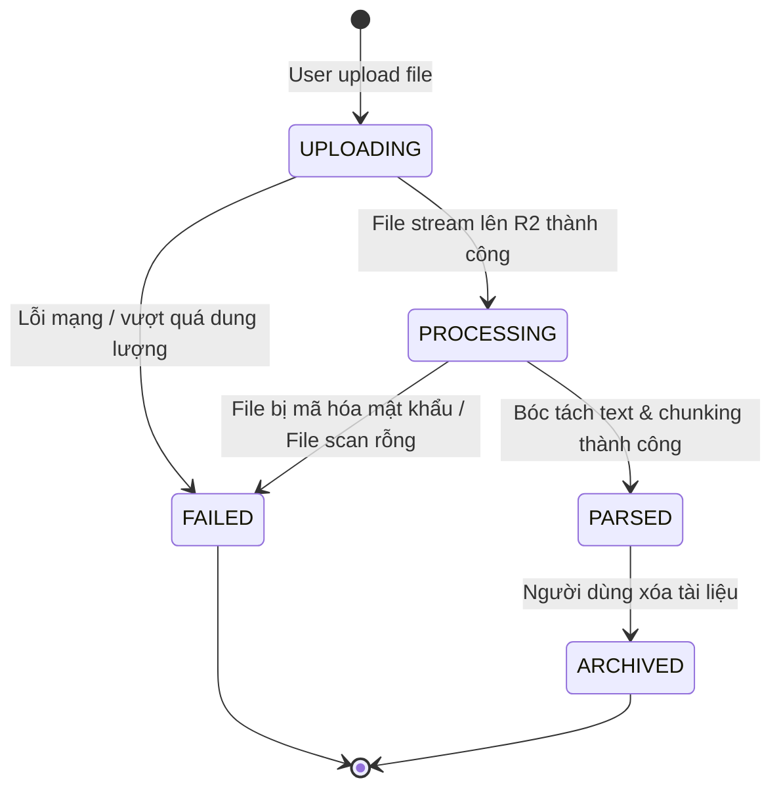

# doc-ingestion — System Requirements Specification (Đặc Tả Kỹ Thuật Hệ Thống)

> **Dịch vụ**: `document-service` (Microservice bóc tách & quản trị tài liệu)  
> **Giao thức**: REST API (kết nối Client qua `api-gateway`) + Message Queue (AMQP/BullMQ giao tiếp `ai-engine-service`).

---

## 🎯 I. System scope (Phạm vi hệ thống của Service)

* **Hệ thống làm**:
  - Tiếp nhận tệp tin tải lên từ Web Client thông qua `api-gateway`.
  - Kiểm tra tính toàn vẹn (MIME-type, dung lượng, độ dài trang).
  - Stream tệp gốc lên Object Storage (Cloudflare R2 / AWS S3).
  - Khởi chạy luồng bóc tách văn bản ngầm (Background Worker) cho PDF và DOCX.
  - Làm sạch văn bản và thực thi thuật toán phân đoạn kiến thức (Chunking).
  - Phát sự kiện `document.ingested` sang Message Queue để kích hoạt AI Engine.
  - Cung cấp API quản lý CRUD cho kho tài liệu cá nhân của người dùng.
* **Hệ thống KHÔNG làm**:
  - Không gọi trực tiếp mô hình ngôn ngữ lớn LLM (việc này thuộc về `ai-engine-worker`).
  - Không quản lý đề thi hoặc câu hỏi (thuộc về `exam-service`).
  - Không xử lý OCR cho ảnh chụp viết tay trong phiên bản MVP.

---

## 👥 II. Actors and systems (Tác nhân & Hệ thống tương tác)

| Tác nhân / Hệ thống | Vai trò & Trách nhiệm | Nguồn liên kết |
|---|---|:---:|
| **Học sinh / Giáo viên** | Tải file lên, xem trước nội dung bóc tách, quản lý thư viện tài liệu cá nhân | `UR-DOC-INGEST-001`, `004` |
| **`api-gateway`** | Giải mã JWT token, kiểm tra Rate Limit và chuyển tiếp request có định danh `user_id` | Kiến trúc Gateway |
| **`document-service`** | Core microservice thực thi toàn bộ logic tiếp nhận, bóc tách và phân đoạn | Phân hệ chính |
| **Cloudflare R2 Storage** | Lưu trữ tệp tin gốc `.pdf` và `.docx` theo chuẩn S3-compatible | `RULE-DOC-INGEST-002` |
| **PostgreSQL Database** | Lưu bảng metadata `documents` và các phân đoạn `document_chunks` | DB chuyên biệt của service |
| **Message Queue (BullMQ/RabbitMQ)** | Nhận event `document.ingested` để chuyển tiếp bất đồng bộ sang AI Worker | `BR-DOC-INGEST-003` |

---

## 📋 III. Functional requirements (Yêu cầu chức năng)

| Mã Yêu Cầu | Kích hoạt & Điều kiện | Hành vi quan sát được của hệ thống | Kết quả đầu ra | Ưu tiên | Nguồn gốc |
|:---|---|---|---|:---:|:---:|
| **`FR-DOC-INGEST-001`** | Client gửi `POST /api/documents/upload` (Multipart Form-data) kèm file | `api-gateway` xác thực token $\rightarrow$ `document-service` kiểm tra: dung lượng $\le 25$MB và MIME-type là PDF hoặc DOCX. Nếu sai từ chối ngay. | Trả về mã `202 Accepted` kèm `document_id` và trạng thái `PROCESSING`. | **P0** | `UR-001`, `RULE-001`, `RULE-002` |
| **`FR-DOC-INGEST-002`** | Sau khi validate file thành công | Service tạo bản ghi trong bảng `documents` với trạng thái `UPLOADING`, đồng thời stream tệp lên bucket Cloudflare R2 tại đường dẫn `/users/{user_id}/docs/{doc_id}.ext`. | Nhận về URL lưu trữ an toàn; cập nhật bản ghi thành `PROCESSING`. | **P0** | `RULE-002`, `RULE-003` |
| **`FR-DOC-INGEST-003`** | Tệp đã lưu vào R2 | Kích hoạt worker bóc tách văn bản nền: Sử dụng `pypdf`/`pdfplumber` đối với file PDF hoặc `python-docx` đối với file Word. Trích xuất text thô tiếng Việt UTF-8. | Tạo bản ghi văn bản trích xuất (Raw Text). | **P0** | `BR-DOC-INGEST-001` |
| **`FR-DOC-INGEST-004`** | Text thô đã bóc tách | Thực thi thuật toán làm sạch: Loại bỏ header/footer lặp trang, số trang, khoảng trắng thừa; chia nhỏ văn bản thành các đoạn (chunks) 1.000–1.500 ký tự (overlap 150 ký tự). | Ghi các phân đoạn vào bảng `document_chunks` (gồm `chunk_id`, `chunk_index`, `content`, `token_estimate`). | **P0** | `UR-003`, `RULE-004` |
| **`FR-DOC-INGEST-005`** | Bóc tách & chunking hoàn tất | Service cập nhật trạng thái document thành `PARSED`, thống kê tổng số từ, số trang và phát sự kiện `document.ingested` vào Message Queue. | Sự kiện sẵn sàng cho `ai-engine-service` tiêu thụ để sinh đề. | **P0** | `BR-DOC-INGEST-003` |
| **`FR-DOC-INGEST-006`** | Client gửi `GET /api/documents/{id}` | Truy vấn thông tin tài liệu: Kiểm tra `user_id` sở hữu $\rightarrow$ Trả về metadata, số trang, trạng thái xử lý và danh sách các chunk tóm tắt để preview. | Trả về `200 OK` kèm JSON chi tiết tài liệu phục vụ xem trước. | **P1** | `UR-DOC-INGEST-002`, `RULE-003` |
| **`FR-DOC-INGEST-007`** | Client gửi `GET /api/documents` | Lấy danh sách tài liệu của người dùng hiện tại (hỗ trợ phân trang, lọc theo môn học/thẻ tag và tìm kiếm theo tên file). | Danh sách tài liệu trong "Thư viện học tập của tôi". | **P1** | `UR-DOC-INGEST-004` |
| **`FR-DOC-INGEST-008`** | Client gửi `DELETE /api/documents/{id}` | Kiểm tra quyền sở hữu $\rightarrow$ Đánh dấu xóa mềm (`is_deleted = true`) hoặc xóa tệp gốc trên R2 kèm các bản ghi `document_chunks` liên quan. | Trả về `200 OK`, dọn sạch dữ liệu tài liệu. | **P1** | `UR-DOC-INGEST-004` |

---

## 🔄 IV. State transitions (Chuyển đổi trạng thái tài liệu)

| Trạng thái gốc | Trạng thái mới | Tác nhân / Sự kiện kích hoạt | Điều kiện chuyển tiếp | FR liên quan |
|---|---|---|---|:---:|
| `(Khởi tạo)` | `UPLOADING` | Học sinh/Giáo viên tải tệp | Token hợp lệ, MIME-type hợp lệ | `FR-DOC-INGEST-001` |
| `UPLOADING` | `PROCESSING` | `document-service` | Tệp tải hoàn tất lên R2 Object Storage | `FR-DOC-INGEST-002` |
| `PROCESSING` | `PARSED` | Background Parser Worker | Bóc tách text $>100$ từ và lưu các chunks thành công | `FR-DOC-INGEST-004`, `005` |
| `PROCESSING` | `FAILED` | Background Parser Worker | File có password hoặc file scan không trích được chữ | `E-DOC-INGEST-003`, `004` |
| `PARSED` | `ARCHIVED` | Người dùng gọi API Delete | Xác nhận xóa khỏi thư viện | `FR-DOC-INGEST-008` |

---

## ⚡ V. Non-functional requirements (Yêu cầu phi chức năng - NFR)

| Mã NFR | Tiêu chuẩn chất lượng | Ngưỡng định lượng đo lường được | Phương pháp kiểm chứng |
|:---|---|---|---|
| **`NFR-DOC-INGEST-001`** | **Tốc độ bóc tách (Performance)** | Tệp văn bản 50 trang xử lý hoàn tất (lưu R2 + parse + chunking) trong $\le 8$ giây (P95). | Đo đạc Benchmark tự động trong kịch bản tải tích hợp. |
| **`NFR-DOC-INGEST-002`** | **Cô lập dữ liệu (Security)** | $100\%$ các truy vấn DB đều có mệnh đề `WHERE user_id = :current_user`. Không rò rỉ dữ liệu giữa 2 người dùng. | Kiểm thử tự động bảo mật (Multi-tenant penetration test). |
| **`NFR-DOC-INGEST-003`** | **Tính sẵn sàng (Reliability)** | Uptime của API tiếp nhận tài liệu đạt $\ge 99.9\%$. Các tác vụ parse nền bị crash phải được tự động retry tối đa 3 lần. | Giám sát qua Prometheus / Grafana health check. |

---

## ⚠️ VI. Error matrix (Ma trận mã lỗi & Hướng khắc phục)

| Mã Lỗi | Tình huống phát sinh | HTTP Status | Thông điệp hiển thị cho người dùng | Hướng xử lý phục hồi |
|---|---|:---:|---|---|
| **`E-DOC-INGEST-001`** | Tệp tải lên có dung lượng $> 25$MB | `413 Payload Too Large` | *"Tệp vượt quá dung lượng tối đa 25MB. Vui lòng nén hoặc tách nhỏ tài liệu."* | Người dùng nén file hoặc tách thành các chương nhỏ. |
| **`E-DOC-INGEST-002`** | Tệp không phải PDF hoặc DOCX (sai MIME-type) | `415 Unsupported Media Type` | *"Định dạng tệp không được hỗ trợ. Vui lòng chỉ tải lên tệp .pdf hoặc .docx."* | Người dùng chọn đúng định dạng tài liệu hợp lệ. |
| **`E-DOC-INGEST-003`** | Tệp PDF hoặc DOCX bị đặt mật khẩu bảo vệ | `422 Unprocessable Entity` | *"Tệp bị khóa mật khẩu. Vui lòng gỡ bỏ mật khẩu bảo vệ trước khi tải lên."* | Người dùng mở khóa file rồi tải lại. |
| **`E-DOC-INGEST-004`** | Tệp PDF scan dạng ảnh chụp thuần không có text | `422 Unprocessable Entity` | *"Tài liệu là ảnh scan không chứa lớp văn bản. Hệ thống chưa hỗ trợ OCR trong bản MVP."* | Người dùng sử dụng file có lớp chữ số hóa. |
| **`E-DOC-INGEST-005`** | Mất kết nối tới Cloudflare R2 Storage | `502 Bad Gateway` | *"Hệ thống lưu trữ đang bận. Đang thử lưu lại tự động..."* | Service kích hoạt cơ chế Retry tự động 3 lần. |
