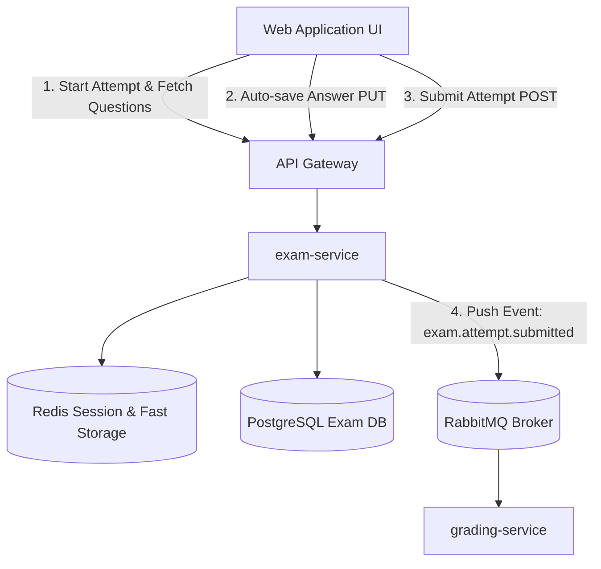
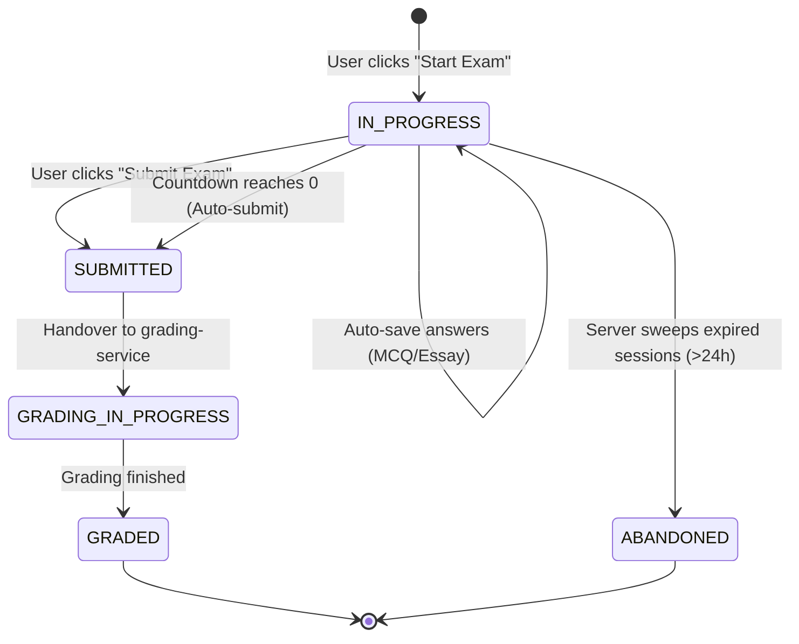

# Đặc tả Yêu cầu Kỹ thuật Hệ thống (SRS) - interactive-testing

**Phân hệ**: `interactive-testing`  
**Microservice phụ trách**: `exam-service`  
**Phiên bản**: 1.0.0  
**Trạng thái**: Draft  
**Truy vết (Traceability)**:
- [interactive-testing-urd.md](file:///C:/Nexis/ownedu/docs/interactive-testing/interactive-testing-urd.md)
- [interactive-testing-brd.md](file:///C:/Nexis/ownedu/docs/interactive-testing/interactive-testing-brd.md)

---

## 1. Ranh giới Microservice & Kiến trúc Tương tác



---

## 2. Danh mục Yêu cầu Chức năng (Functional Requirements)

| Mã FR | Tên Chức năng | Mô tả Nghiệp vụ & Kỹ thuật | Phục vụ URD / BRD |
| :--- | :--- | :--- | :--- |
| **FR-TEST-001** | Khởi tạo Phiên thi (`Start Attempt`) | Kiểm tra trạng thái đề thi (`PUBLISHED`), cấp bản ghi `exam_attempts` mới với `status: IN_PROGRESS`, tính toán `expires_at = now + duration`. Trả về danh sách câu hỏi (ẩn đáp án đúng). | `UR-TEST-001`, `RULE-TEST-001` |
| **FR-TEST-002** | Khôi phục Trạng thái Phiên thi | Khi người dùng reload trang hoặc đăng nhập lại, trả về toàn bộ câu trả lời nháp và danh sách các câu đã cắm cờ (Flagged) từ Redis/DB. | `UR-TEST-002`, `BR-TEST-001` |
| **FR-TEST-003** | Tự động Lưu Câu trả lời (Auto-save) | Tiếp nhận câu trả lời đơn lẻ cho MCQ (selected option key) hoặc Essay (text content). Ghi tạm vào Redis và ghi định kỳ vào DB với độ trễ phản hồi < 100ms. | `UR-TEST-003`, `UR-TEST-005`, `RULE-TEST-004` |
| **FR-TEST-004** | Đánh dấu Câu hỏi (Flag for Review) | Cho phép thí sinh bật/tắt cờ đánh dấu trên từng câu hỏi để dễ dàng lọc xem lại trên Question Palette. | `UR-TEST-002` |
| **FR-TEST-005** | Đồng bộ Đồng hồ Server (Heartbeat Sync) | Định kỳ mỗi 60 giây, Client gửi ping nhẹ để đồng bộ sai lệch đồng hồ (`time_remaining_seconds`) nhằm tránh hiện tượng chênh lệch thời gian máy thí sinh. | `UR-TEST-004`, `RULE-TEST-001` |
| **FR-TEST-006** | Nộp bài Thi Chủ động | Tiếp nhận lệnh nộp bài từ người dùng, kiểm tra `expires_at + grace_period`, chuyển trạng thái `status: SUBMITTED`, khóa chỉnh sửa (`RULE-TEST-003`). | `UR-TEST-006`, `RULE-TEST-002` |
| **FR-TEST-007** | Tự động Khóa & Nộp bài khi Hết giờ | Scheduled Job chạy trên worker kiểm tra các phiên thi đã hết hạn mà chưa nộp bài, tự động thu hồi và kích hoạt luồng nộp bài bắt buộc. | `UR-TEST-006`, `RULE-TEST-001` |
| **FR-TEST-008** | Phát hành Sự kiện Chấm điểm | Đóng gói toàn bộ bài làm của thí sinh kèm barem rubric gốc của đề thi, phát hành sự kiện `exam.attempt.submitted` lên Message Queue. | `BR-TEST-004` |

---

## 3. Data Contracts & Payload Schemas

### 3.1. Auto-save Payload (`PUT /api/v1/attempts/{attempt_id}/answers/{question_id}`)
```json
{
  "question_id": "q_01",
  "answer_type": "MCQ",
  "selected_option": "B",
  "text_content": null,
  "client_timestamp": "2026-09-18T23:20:00.000Z"
}
```
*Đối với câu tự luận:*
```json
{
  "question_id": "q_02",
  "answer_type": "ESSAY",
  "selected_option": null,
  "text_content": "Tách riêng qua Message Queue giúp giảm tải API Gateway...",
  "client_timestamp": "2026-09-18T23:20:15.000Z"
}
```

### 3.2. Event Payload Bàn giao sang Chấm điểm (`exam.attempt.submitted`)
```json
{
  "event_type": "exam.attempt.submitted",
  "attempt_id": "att_11223344-aabb-ccdd-eeff-001122334455",
  "exam_id": "exam_91827364-55aa-44bb-33cc-221100aabbcc",
  "user_id": "usr_998877",
  "submitted_at": "2026-09-18T23:45:00.000Z",
  "answers": [
    {
      "question_id": "q_01",
      "type": "MCQ",
      "selected_option": "B",
      "correct_answer": "B",
      "points": 0.5
    },
    {
      "question_id": "q_02",
      "type": "ESSAY",
      "student_text": "Tách riêng qua Message Queue giúp giảm tải API Gateway...",
      "benchmark_answer": "Tách riêng qua Message Queue giúp giảm tải...",
      "rubric": [
        {"criteria": "Phân tích được ít nhất 2 ưu điểm", "max_points": 1.0},
        {"criteria": "Chỉ ra được nhược điểm", "max_points": 0.5},
        {"criteria": "Lấy được ví dụ minh họa", "max_points": 1.0}
      ],
      "points": 2.5
    }
  ]
}
```

---

## 4. Máy Trạng Thái Phiên Thi (Attempt State Machine)



---

## 5. Ma trận Mã Lỗi Hệ thống (Error Code Catalog)

| Mã Lỗi | HTTP Code | Tên Lỗi | Nguyên nhân & Hành vi Khắc phục |
| :--- | :--- | :--- | :--- |
| **E-TEST-001** | `404 Not Found` | `EXAM_NOT_FOUND_OR_UNPUBLISHED` | Đề thi chưa được xuất bản hoặc đã bị chủ sở hữu xóa. |
| **E-TEST-002** | `409 Conflict` | `ATTEMPT_ALREADY_SUBMITTED` | Người dùng cố tình gửi đáp án sau khi bài thi đã ở trạng thái `SUBMITTED` (`RULE-TEST-003`). |
| **E-TEST-003** | `403 Forbidden` | `EXAM_EXPIRED` | Thời gian gửi bài vượt quá hạn chót + thời gian gia hạn 30s (`RULE-TEST-001`, `002`). |
| **E-TEST-004** | `429 Too Many Requests`| `AUTO_SAVE_RATE_LIMITED` | Client gửi request lưu bài với tần suất quá cao (> 1 req/s). Client cần chờ debounce 2 giây. |
