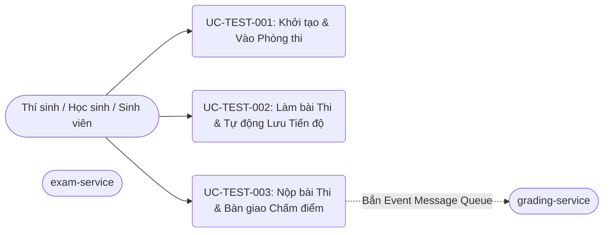

# Danh mục Use Cases - interactive-testing

**Phân hệ**: `interactive-testing`  
**Microservice**: `exam-service`  
**Phiên bản**: 1.0.0  
**Trạng thái**: Draft  
**Truy vết (Traceability)**:
- [interactive-testing-urd.md](file:///C:/Nexis/ownedu/docs/interactive-testing/interactive-testing-urd.md)
- [interactive-testing-brd.md](file:///C:/Nexis/ownedu/docs/interactive-testing/interactive-testing-brd.md)
- [interactive-testing-spec.md](file:///C:/Nexis/ownedu/docs/interactive-testing/srs/interactive-testing-spec.md)

---

## 1. Sơ đồ Tổng quan Use Cases (Use Case Overview)

---

## 2. Bảng Danh mục Chi tiết Use Cases

| Mã Use Case | Tên Use Case | Actor Chính | Mục tiêu Nghiệp vụ | Mã FR Liên kết | Mã Lỗi Tiềm ẩn |
| :--- | :--- | :--- | :--- | :--- | :--- |
| [UC-TEST-001](file:///C:/Nexis/ownedu/docs/interactive-testing/usecases/uc-start-exam-session.md) | Khởi tạo & Vào Phòng thi | Thí sinh | Nhận đề thi, khởi động đồng hồ đếm ngược đồng bộ server, thiết lập môi trường thi an toàn. | `FR-TEST-001`, `FR-TEST-002` | `E-TEST-001`, `E-TEST-002` |
| [UC-TEST-002](file:///C:/Nexis/ownedu/docs/interactive-testing/usecases/uc-take-exam-autosave.md) | Làm bài Thi & Tự động Lưu Tiến độ | Thí sinh | Chọn trắc nghiệm, viết tự luận, cắm cờ câu hỏi xem lại, hệ thống tự động lưu nền mượt mà. | `FR-TEST-003`, `FR-TEST-004`, `FR-TEST-005` | `E-TEST-004` |
| [UC-TEST-003](file:///C:/Nexis/ownedu/docs/interactive-testing/usecases/uc-submit-exam-session.md) | Nộp bài Thi & Bàn giao Chấm điểm | Thí sinh / Hệ thống | Khóa bài làm, xác nhận nộp hoặc tự nộp khi hết giờ, bàn giao dữ liệu sang `grading-service`. | `FR-TEST-006`, `FR-TEST-007`, `FR-TEST-008` | `E-TEST-002`, `E-TEST-003` |
